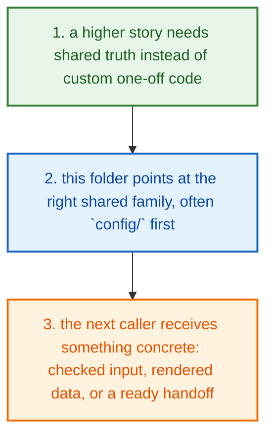
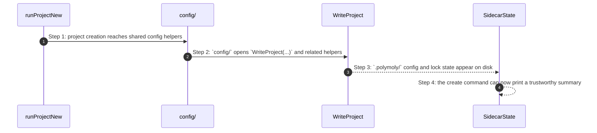

# System Shared How This Works

## What this folder is

`system/shared/` is the reusable helper foundation for the machine-facing tree.

This folder exists so engine, adapters, gates, and tooling reuse the same config, CLI, logging, and utility behavior instead of re-implementing it badly.

## Real commands or triggers that reach this folder

- `poly new my-app --framework laravel`
- `poly status`
- `poly gate run docs`
- any higher flow that needs shared config, CLI formatting, logging, errors, or utility helpers

## Exact upstream handoffs

- `runProjectNew(...)` commonly reaches shared config helpers
- runtime and gate paths also reach shared config, shared CLI, or shared utility helpers instead of re-implementing them
- once you know the helper family, jump into `config/`, `cli/`, `logging/`, `errors/`, or `utils/`

## The simplest story

- a higher story gets to a point where rewriting the same helper logic would be a mistake
- this folder sends that story to the correct shared family, most often `config/` first
- by the end, the caller gets reused truth back instead of hand-written duplication



## The first important path

When a real caller reaches this slice for this exact reason:

```bash
poly new my-app --framework laravel
```

the important path is:



- **Step 1:** Shared code exists so the same truth is not reimplemented five different ways.
- **Step 2:** In practice, `config/` is one of the busiest shared families.
- **Step 3:** The shared layer usually does not own the final CLI message, but it makes that message trustworthy.
- **Step 4:** If a command summary looks suspicious, shared helpers are often the place where the wrong fact was first produced.

## Direct files in this folder

This folder has no direct first-party files besides this guide.

## Child folders in this folder

### `cli/`

Open [`cli/how-this-works.md`](./cli/how-this-works.md).

Use it when the story includes:

- engine, tools, and adapters call this shared slice instead of copying the same helpers

### `config/`

Open [`config/how-this-works.md`](./config/how-this-works.md).

Use it when the story includes:

- engine, tools, and adapters call this shared slice instead of copying the same helpers

### `errors/`

Open [`errors/how-this-works.md`](./errors/how-this-works.md).

Use it when the story includes:

- engine, tools, and adapters call this shared slice instead of copying the same helpers

### `logging/`

Open [`logging/how-this-works.md`](./logging/how-this-works.md).

Use it when the story includes:

- engine, tools, and adapters call this shared slice instead of copying the same helpers

### `utils/`

Open [`utils/how-this-works.md`](./utils/how-this-works.md).

Use it when the story includes:

- engine, tools, and adapters call this shared slice instead of copying the same helpers

## Debug first

- open `cli/how-this-works.md` when the symptom clearly belongs to that child story
- open `config/how-this-works.md` when the symptom clearly belongs to that child story
- open `errors/how-this-works.md` when the symptom clearly belongs to that child story
- open `logging/how-this-works.md` when the symptom clearly belongs to that child story
- open `utils/how-this-works.md` when the symptom clearly belongs to that child story

## What to remember

- `system/shared/` exists so this slice has one obvious home.
- The fastest map is still the naming law: folder for flow, file for responsibility, function for exact action.
- If the folder overview feels too wide, jump to the child slice that matches the current symptom instead of reading sideways.

## Dictionary

<a id="dictionary-system"></a>
- `system`: The system is the machine-facing body of PolyMoly. It holds the code, assets, checks, and boundaries that make product stories real.
<a id="dictionary-engine"></a>
- `engine`: The engine is the decision core. It reads intent, matches capabilities, prepares render data, and hands safe work to the next layer.
<a id="dictionary-adapter"></a>
- `adapter`: An adapter is the place where PolyMoly touches the outside world, like files, Docker, environment files, or the browser.
<a id="dictionary-gate"></a>
- `gate`: A gate is a verification run that decides PASS or FAIL before trust increases.
<a id="dictionary-artifact"></a>
- `artifact`: An artifact is a file, bundle, or proof another tool or operator can read later.
<a id="dictionary-runtime"></a>
- `runtime`: Runtime is the live or rendered execution world PolyMoly starts, previews, inspects, or validates.
