# System Shared Utils How This Works

## What this folder is

`system/shared/utils/` holds lower-level utility helpers reused by more than one system slice.

These helpers are small, but they matter because they stop many other folders from duplicating the same low-level work.

## Real commands or triggers that reach this folder

- engine, tools, and adapters call this shared slice instead of copying the same helpers

## Exact upstream handoffs

- engine, tooling, and adapters call this shared tree instead of re-implementing the same helpers
- once you know the helper family, jump into the narrower child slice for config, CLI, logging, errors, or utilities

## The simplest story

- a higher product, engine, or tooling story reaches this slice because it needs one reusable step
- this folder does one small machine-facing job, often starting in `generate_system_report.go`
- the next step gets something concrete back: a helper result, a rendered model, an adapter handoff, or a cleaner request

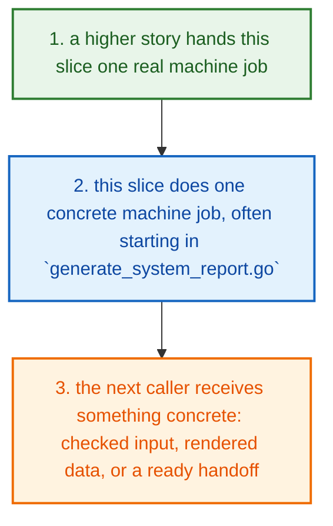

## The first important path

When a real caller reaches this slice for this exact reason:

```text
engine, tools, and adapters call this shared slice instead of copying the same helpers
```

the important path is:

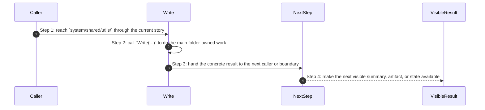

- **Step 1:** This is the moment the story actually enters this folder instead of staying in a higher router or parent helper.
- **Step 2:** The first real work starts in `generate_system_report.go` through `Write(...)`.
- **Step 3:** From here, the story moves to one smaller file, child slice, or boundary that can do the next concrete job.
- **Step 4:** At the end, the caller has something concrete to carry forward: a file on disk, a rendered asset, a proof artifact, or a clear next state.

## Direct files in this folder

### `capture_shell_commands.go`

This file is one direct stop in the story for this folder.

Why this name is honest:

- its main action is still visible in the code, starting with `CaptureCommand(...)`

When the story opens this file:

- when the `system/shared/utils/` story needs this responsibility, it opens `capture_shell_commands.go`

What arrives here:

- caller-provided values from the parent flow

What leaves this file:

- the result of `CaptureCommand(...)` for the next caller
- a concrete return value, file write, check result, or summary depending on the path

Why you open it first:

- open this file when the symptom points to `CaptureCommand(...)` doing the wrong thing

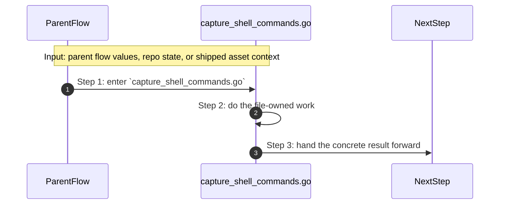

- **Step 1:** The story reaches `capture_shell_commands.go` because this file owns the next small responsibility.
- **Step 2:** The file does its own narrow action instead of mixing it into a bigger caller.
- **Step 3:** The next caller gets a concrete result, not another vague promise.

Important functions:

- `ResolveTimeout(...)`
  Small helper for one narrow sub-step. It exists so the main path stays readable.
- `CaptureCommand(...)`
  This is the main action in the file. It does the folder's primary job and returns the next concrete result.
- `CaptureCommandWithEnv(...)`
  Small helper for one narrow sub-step. It exists so the main path stays readable.
- `CaptureCommandWithInput(...)`
  Small helper for one narrow sub-step. It exists so the main path stays readable.
- `runCommand(...)`
  Small helper for one narrow sub-step. It exists so the main path stays readable.
- `StreamCommand(...)`
  Small helper for one narrow sub-step. It exists so the main path stays readable.
- `CommandAvailable(...)`
  Small helper for one narrow sub-step. It exists so the main path stays readable.
- `DockerReady(...)`
  Small helper for one narrow sub-step. It exists so the main path stays readable.

### `engine.go`

This file is one direct stop in the story for this folder.

Why this name is honest:

- its main action is still visible in the code, starting with `AsMapSlice(...)`

When the story opens this file:

- when the `system/shared/utils/` story needs this responsibility, it opens `engine.go`

What arrives here:

- caller-provided values from the parent flow

What leaves this file:

- the result of `AsMapSlice(...)` for the next caller
- a concrete return value, file write, check result, or summary depending on the path

Why you open it first:

- open this file when the symptom points to `AsMapSlice(...)` doing the wrong thing

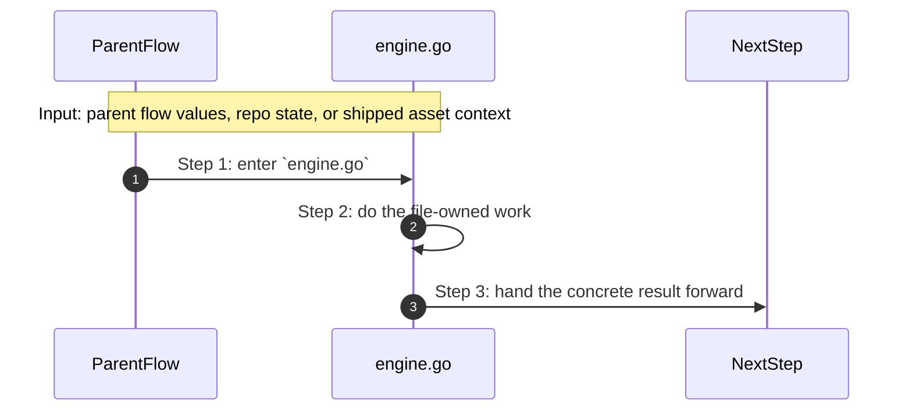

- **Step 1:** The story reaches `engine.go` because this file owns the next small responsibility.
- **Step 2:** The file does its own narrow action instead of mixing it into a bigger caller.
- **Step 3:** The next caller gets a concrete result, not another vague promise.

Important functions:

- `BuildDiagnostic(...)`
  Small helper for one narrow sub-step. It exists so the main path stays readable.
- `DiagnosticsOK(...)`
  Small helper for one narrow sub-step. It exists so the main path stays readable.
- `SortedUniqueStrings(...)`
  Small helper for one narrow sub-step. It exists so the main path stays readable.
- `Clone(...)`
  Small helper for one narrow sub-step. It exists so the main path stays readable.
- `DeepMerge(...)`
  Small helper for one narrow sub-step. It exists so the main path stays readable.
- `AsMap(...)`
  Small helper for one narrow sub-step. It exists so the main path stays readable.
- `AsSlice(...)`
  Small helper for one narrow sub-step. It exists so the main path stays readable.
- `AsStringSlice(...)`
  Small helper for one narrow sub-step. It exists so the main path stays readable.
- `AsMapSlice(...)`
  This is the main action in the file. It does the folder's primary job and returns the next concrete result.
- `StringValue(...)`
  Small helper for one narrow sub-step. It exists so the main path stays readable.

### `find_project_root.go`

This file is one direct stop in the story for this folder.

Why this name is honest:

- its main action is still visible in the code, starting with `FindRoot(...)`

When the story opens this file:

- when the `system/shared/utils/` story needs this responsibility, it opens `find_project_root.go`

What arrives here:

- caller-provided values from the parent flow
- repo or project paths that tell the file where to read or write

What leaves this file:

- the result of `FindRoot(...)` for the next caller
- a concrete return value, file write, check result, or summary depending on the path

Why you open it first:

- open this file when the symptom points to `FindRoot(...)` doing the wrong thing

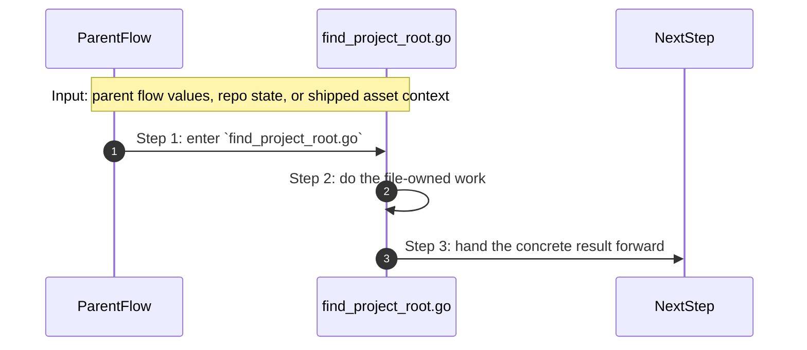

- **Step 1:** The story reaches `find_project_root.go` because this file owns the next small responsibility.
- **Step 2:** The file does its own narrow action instead of mixing it into a bigger caller.
- **Step 3:** The next caller gets a concrete result, not another vague promise.

Important functions:

- `FindRoot(...)`
  This is the main action in the file. It does the folder's primary job and returns the next concrete result.

### `generate_system_report.go`

This file is one direct stop in the story for this folder.

Why this name is honest:

- its main action is still visible in the code, starting with `Write(...)`

When the story opens this file:

- when the `system/shared/utils/` story needs this responsibility, it opens `generate_system_report.go`

What arrives here:

- caller-provided values from the parent flow

What leaves this file:

- the result of `Write(...)` for the next caller
- a concrete return value, file write, check result, or summary depending on the path

Why you open it first:

- open this file when the symptom points to `Write(...)` doing the wrong thing

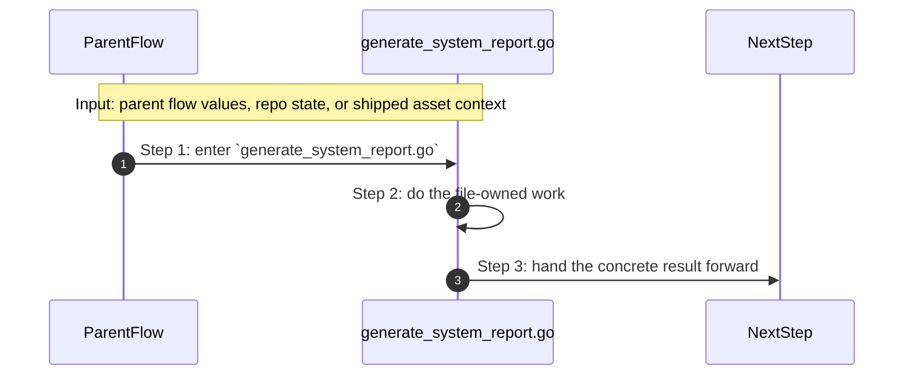

- **Step 1:** The story reaches `generate_system_report.go` because this file owns the next small responsibility.
- **Step 2:** The file does its own narrow action instead of mixing it into a bigger caller.
- **Step 3:** The next caller gets a concrete result, not another vague promise.

Important functions:

- `NewReporter(...)`
  Small helper for one narrow sub-step. It exists so the main path stays readable.
- `NewReporterAt(...)`
  Small helper for one narrow sub-step. It exists so the main path stays readable.
- `Pass(...)`
  Small helper for one narrow sub-step. It exists so the main path stays readable.
- `Fail(...)`
  Small helper for one narrow sub-step. It exists so the main path stays readable.
- `Skip(...)`
  Small helper for one narrow sub-step. It exists so the main path stays readable.
- `Failures(...)`
  Small helper for one narrow sub-step. It exists so the main path stays readable.
- `Total(...)`
  Small helper for one narrow sub-step. It exists so the main path stays readable.
- `Gate(...)`
  Small helper for one narrow sub-step. It exists so the main path stays readable.
- `Write(...)`
  This is the main action in the file. It does the folder's primary job and returns the next concrete result.
- `Relative(...)`
  Small helper for one narrow sub-step. It exists so the main path stays readable.
- `tsvEscape(...)`
  Small helper for one narrow sub-step. It exists so the main path stays readable.
- `WriteRequired(...)`
  Small helper for one narrow sub-step. It exists so the main path stays readable.

### `generate_tls_certificates.go`

This file is one direct stop in the story for this folder.

Why this name is honest:

- its main action is still visible in the code, starting with `Generate(...)`

When the story opens this file:

- when the `system/shared/utils/` story needs this responsibility, it opens `generate_tls_certificates.go`

What arrives here:

- caller-provided values from the parent flow

What leaves this file:

- the result of `Generate(...)` for the next caller
- a concrete return value, file write, check result, or summary depending on the path

Why you open it first:

- open this file when the symptom points to `Generate(...)` doing the wrong thing


- **Step 1:** The story reaches `generate_tls_certificates.go` because this file owns the next small responsibility.
- **Step 2:** The file does its own narrow action instead of mixing it into a bigger caller.
- **Step 3:** The next caller gets a concrete result, not another vague promise.

Important functions:

- `Generate(...)`
  This is the main action in the file. It does the folder's primary job and returns the next concrete result.

### `inspect_filesystem_state.go`

This file is one direct stop in the story for this folder.

Why this name is honest:

- its main action is still visible in the code, starting with `MatchFile(...)`

When the story opens this file:

- when the `system/shared/utils/` story needs this responsibility, it opens `inspect_filesystem_state.go`

What arrives here:

- caller-provided values from the parent flow

What leaves this file:

- the result of `MatchFile(...)` for the next caller
- a concrete return value, file write, check result, or summary depending on the path

Why you open it first:

- open this file when the symptom points to `MatchFile(...)` doing the wrong thing

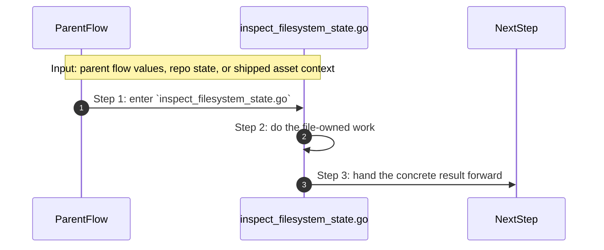

- **Step 1:** The story reaches `inspect_filesystem_state.go` because this file owns the next small responsibility.
- **Step 2:** The file does its own narrow action instead of mixing it into a bigger caller.
- **Step 3:** The next caller gets a concrete result, not another vague promise.

Important functions:

- `FileExists(...)`
  Small helper for one narrow sub-step. It exists so the main path stays readable.
- `DirExists(...)`
  Small helper for one narrow sub-step. It exists so the main path stays readable.
- `MustRead(...)`
  Small helper for one narrow sub-step. It exists so the main path stays readable.
- `MatchFile(...)`
  This is the main action in the file. It does the folder's primary job and returns the next concrete result.
- `MatchString(...)`
  Small helper for one narrow sub-step. It exists so the main path stays readable.
- `CountFile(...)`
  Small helper for one narrow sub-step. It exists so the main path stays readable.
- `ServiceBlock(...)`
  Small helper for one narrow sub-step. It exists so the main path stays readable.
- `ExtractSection(...)`
  Small helper for one narrow sub-step. It exists so the main path stays readable.
- `ReadEnvFile(...)`
  Small helper for one narrow sub-step. It exists so the main path stays readable.
- `FindFiles(...)`
  Small helper for one narrow sub-step. It exists so the main path stays readable.

### `rotate_system_secrets.go`

This file is one direct stop in the story for this folder.

Why this name is honest:

- its main action is still visible in the code, starting with `PreparePromotedSecrets(...)`

When the story opens this file:

- when the `system/shared/utils/` story needs this responsibility, it opens `rotate_system_secrets.go`

What arrives here:

- caller-provided values from the parent flow

What leaves this file:

- the result of `PreparePromotedSecrets(...)` for the next caller
- a concrete return value, file write, check result, or summary depending on the path

Why you open it first:

- open this file when the symptom points to `PreparePromotedSecrets(...)` doing the wrong thing

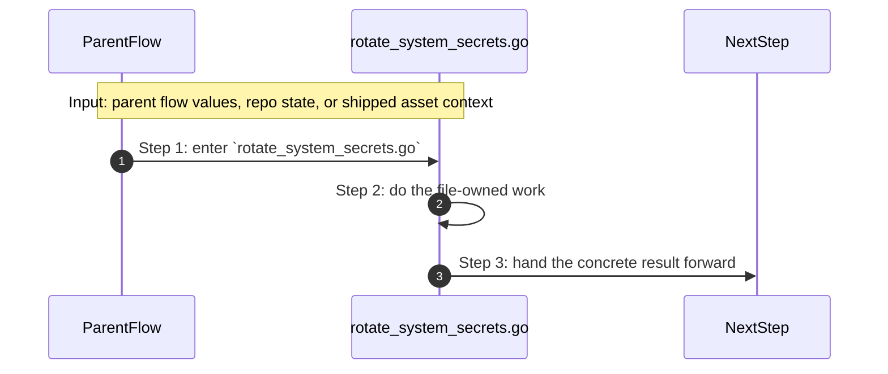

- **Step 1:** The story reaches `rotate_system_secrets.go` because this file owns the next small responsibility.
- **Step 2:** The file does its own narrow action instead of mixing it into a bigger caller.
- **Step 3:** The next caller gets a concrete result, not another vague promise.

Important functions:

- `Rotate(...)`
  Small helper for one narrow sub-step. It exists so the main path stays readable.
- `PreparePromotedSecrets(...)`
  This is the main action in the file. It does the folder's primary job and returns the next concrete result.
- `resolvePromotedSecretValue(...)`
  Small helper for one narrow sub-step. It exists so the main path stays readable.
- `looksLikeSecretPlaceholder(...)`
  Small helper for one narrow sub-step. It exists so the main path stays readable.
- `envValue(...)`
  Small helper for one narrow sub-step. It exists so the main path stays readable.
- `replaceEnvValue(...)`
  Small helper for one narrow sub-step. It exists so the main path stays readable.
- `randomToken(...)`
  Small helper for one narrow sub-step. It exists so the main path stays readable.
- `withDefault(...)`
  Small helper for one narrow sub-step. It exists so the main path stays readable.

### `rotate_system_secrets_test.go`

This test file locks one real behavior in this folder and fails loudly when that behavior drifts.

Why this name is honest:

- its main action is still visible in the code, starting with `TestPreparePromotedSecretsFailsWithoutRealSecretInputs(...)`

When the story opens this file:

- when the `system/shared/utils/` story needs this responsibility, it opens `rotate_system_secrets_test.go`

What arrives here:

- caller-provided values from the parent flow

What leaves this file:

- test proof for one regression shape
- clear failure when the behavior drifts

Why you open it first:

- a test case in this file is the fastest proof of the contract that drifted

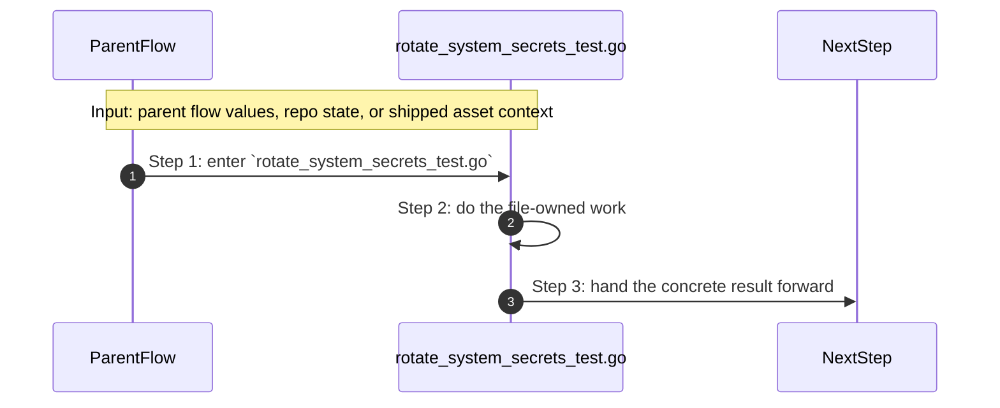

- **Step 1:** The story reaches `rotate_system_secrets_test.go` because this file owns the next small responsibility.
- **Step 2:** The file does its own narrow action instead of mixing it into a bigger caller.
- **Step 3:** The next caller gets a concrete result, not another vague promise.

Important functions:

- `TestPreparePromotedSecretsFailsWithoutRealSecretInputs(...)`
  One proof case in this file. It locks one expected behavior so a regression fails loudly.
- `TestPreparePromotedSecretsWrites0600FilesWithProvidedValues(...)`
  One proof case in this file. It locks one expected behavior so a regression fails loudly.
- `TestPreparePromotedSecretsSupportsExplicitEphemeralUnsafeMode(...)`
  One proof case in this file. It locks one expected behavior so a regression fails loudly.
- `assertSecretFile(...)`
  Small helper for one narrow sub-step. It exists so the main path stays readable.
- `assertGeneratedSecret(...)`
  Small helper for one narrow sub-step. It exists so the main path stays readable.

### `sign_and_validate_jwt_tokens.go`

This file is one direct stop in the story for this folder.

Why this name is honest:

- its main action is still visible in the code, starting with `GenerateInternalJWT(...)`

When the story opens this file:

- when the `system/shared/utils/` story needs this responsibility, it opens `sign_and_validate_jwt_tokens.go`

What arrives here:

- caller-provided values from the parent flow

What leaves this file:

- the result of `GenerateInternalJWT(...)` for the next caller
- a concrete return value, file write, check result, or summary depending on the path

Why you open it first:

- open this file when the symptom points to `GenerateInternalJWT(...)` doing the wrong thing

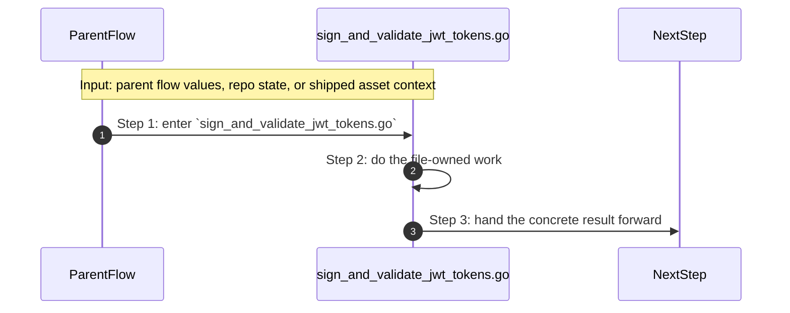

- **Step 1:** The story reaches `sign_and_validate_jwt_tokens.go` because this file owns the next small responsibility.
- **Step 2:** The file does its own narrow action instead of mixing it into a bigger caller.
- **Step 3:** The next caller gets a concrete result, not another vague promise.

Important functions:

- `GenerateInternalJWT(...)`
  This is the main action in the file. It does the folder's primary job and returns the next concrete result.
- `loadOrGeneratePrivateKey(...)`
  Small helper for one narrow sub-step. It exists so the main path stays readable.
- `signJWT(...)`
  Small helper for one narrow sub-step. It exists so the main path stays readable.
- `writePublicKey(...)`
  Small helper for one narrow sub-step. It exists so the main path stays readable.
- `writeJWKS(...)`
  Small helper for one narrow sub-step. It exists so the main path stays readable.

### `sign_and_validate_jwt_tokens_test.go`

This test file locks one real behavior in this folder and fails loudly when that behavior drifts.

Why this name is honest:

- its main action is still visible in the code, starting with `TestGenerateInternalJWTWritesCompleteArtifactsWithoutPrintingToken(...)`

When the story opens this file:

- when the `system/shared/utils/` story needs this responsibility, it opens `sign_and_validate_jwt_tokens_test.go`

What arrives here:

- caller-provided values from the parent flow

What leaves this file:

- test proof for one regression shape
- clear failure when the behavior drifts

Why you open it first:

- a test case in this file is the fastest proof of the contract that drifted

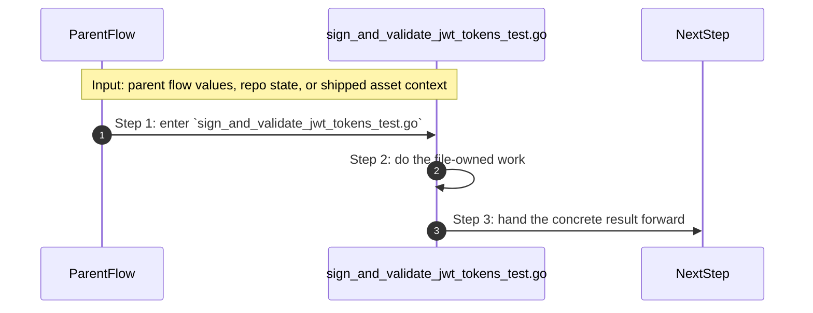

- **Step 1:** The story reaches `sign_and_validate_jwt_tokens_test.go` because this file owns the next small responsibility.
- **Step 2:** The file does its own narrow action instead of mixing it into a bigger caller.
- **Step 3:** The next caller gets a concrete result, not another vague promise.

Important functions:

- `TestGenerateInternalJWTWritesCompleteArtifactsWithoutPrintingToken(...)`
  One proof case in this file. It locks one expected behavior so a regression fails loudly.
- `TestGenerateInternalJWTPrintsTokenOnlyWithExplicitOptIn(...)`
  One proof case in this file. It locks one expected behavior so a regression fails loudly.
- `captureJWTStdout(...)`
  Small helper for one narrow sub-step. It exists so the main path stays readable.
- `assertReadablePEM(...)`
  Small helper for one narrow sub-step. It exists so the main path stays readable.
- `assertJWKS(...)`
  Small helper for one narrow sub-step. It exists so the main path stays readable.

## Child folders in this folder

This folder has no child folders in scope.

## Debug first

- start with `CaptureCommand(...)` in `capture_shell_commands.go` when that action looks wrong
- start with `AsMapSlice(...)` in `engine.go` when that action looks wrong
- start with `FindRoot(...)` in `find_project_root.go` when that action looks wrong
- start with `Write(...)` in `generate_system_report.go` when that action looks wrong
- start with `Generate(...)` in `generate_tls_certificates.go` when that action looks wrong
- start with `MatchFile(...)` in `inspect_filesystem_state.go` when that action looks wrong
- start with `PreparePromotedSecrets(...)` in `rotate_system_secrets.go` when that action looks wrong
- start with `TestPreparePromotedSecretsFailsWithoutRealSecretInputs(...)` in `rotate_system_secrets_test.go` when that action looks wrong

## What to remember

- `system/shared/utils/` exists so this slice has one obvious home.
- The fastest map is still the naming law: folder for flow, file for responsibility, function for exact action.
- If the visible result is wrong, start with the first direct file that owns the next honest action in the flow.

## Dictionary

<a id="dictionary-system"></a>
- `system`: The system is the machine-facing body of PolyMoly. It holds the code, assets, checks, and boundaries that make product stories real.
<a id="dictionary-engine"></a>
- `engine`: The engine is the decision core. It reads intent, matches capabilities, prepares render data, and hands safe work to the next layer.
<a id="dictionary-adapter"></a>
- `adapter`: An adapter is the place where PolyMoly touches the outside world, like files, Docker, environment files, or the browser.
<a id="dictionary-gate"></a>
- `gate`: A gate is a verification run that decides PASS or FAIL before trust increases.
<a id="dictionary-artifact"></a>
- `artifact`: An artifact is a file, bundle, or proof another tool or operator can read later.
<a id="dictionary-runtime"></a>
- `runtime`: Runtime is the live or rendered execution world PolyMoly starts, previews, inspects, or validates.
