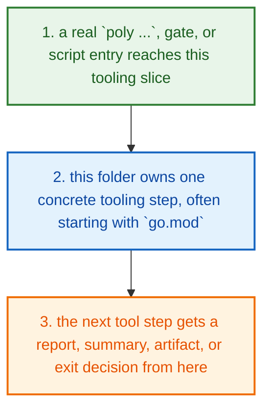
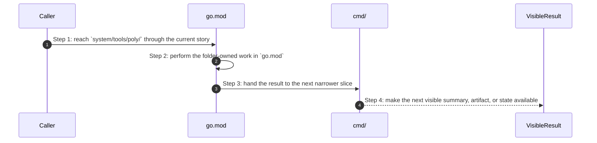
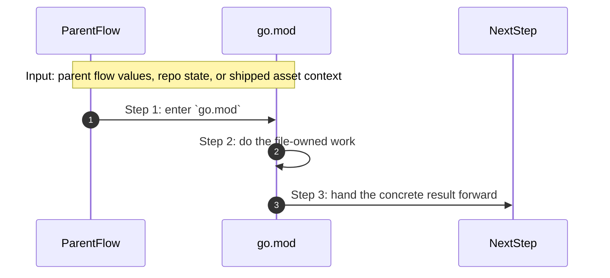

# System Tools Poly How This Works

## What this folder is

`system/tools/poly/` is the source tree for the Poly CLI and its internal tooling support.

It is the place to open when you want the source-native command path, not just the built binary.

## Real commands or triggers that reach this folder

- the source-native Poly CLI build and run flow

## Exact upstream handoffs

- the CLI, runner, gates, and shipped runtime assets all eventually hand work into this tree
- open the narrower child slice once you know whether the story is product, engine, adapter, shared, runtime, gate, or tooling work

## The simplest story

- a real `poly ...`, gate, or script entry reaches this tooling slice
- this folder owns one concrete tooling step, often starting with `go.mod`
- the next tool step gets a report, summary, artifact, or exit decision from here



## The first important path

When a real caller reaches this slice for this exact reason:

```text
the source-native Poly CLI build and run flow
```

the important path is:



- **Step 1:** This is the moment the story actually enters this folder instead of staying in a higher router or parent helper.
- **Step 2:** The first real work starts in `go.mod`.
- **Step 3:** From here, the story moves to one smaller file, child slice, or boundary that can do the next concrete job.
- **Step 4:** At the end, the caller has something concrete to carry forward: a file on disk, a rendered asset, a proof artifact, or a clear next state.

## Direct files in this folder

### `go.mod`

This file ships the `go.mod` asset that the next technical step reads directly.

Why this name is honest:

- the file name already tells you what concrete artifact or config lives here

When the story opens this file:

- when the `system/tools/poly/` story needs this responsibility, it opens `go.mod`

What arrives here:

- the next render, runtime, or browser step reads this shipped asset as-is

What leaves this file:

- the shipped `go.mod` asset
- a concrete file the next render or runtime step can read directly

Why you open it first:

- open this file when the generated or shipped asset itself looks wrong



- **Step 1:** The story reaches `go.mod` because this file owns the next small responsibility.
- **Step 2:** The file does its own narrow action instead of mixing it into a bigger caller.
- **Step 3:** The next caller gets a concrete result, not another vague promise.

Important functions:

This file does not expose top-level functions. That is fine. The file itself is the artifact the next step reads.

### `go.sum`

This file ships the `go.sum` asset that the next technical step reads directly.

Why this name is honest:

- the file name already tells you what concrete artifact or config lives here

When the story opens this file:

- when the `system/tools/poly/` story needs this responsibility, it opens `go.sum`

What arrives here:

- the next render, runtime, or browser step reads this shipped asset as-is

What leaves this file:

- the shipped `go.sum` asset
- a concrete file the next render or runtime step can read directly

Why you open it first:

- open this file when the generated or shipped asset itself looks wrong


- **Step 1:** The story reaches `go.sum` because this file owns the next small responsibility.
- **Step 2:** The file does its own narrow action instead of mixing it into a bigger caller.
- **Step 3:** The next caller gets a concrete result, not another vague promise.

Important functions:

This file does not expose top-level functions. That is fine. The file itself is the artifact the next step reads.

## Child folders in this folder

### `cmd/`

Open [`cmd/how-this-works.md`](./cmd/how-this-works.md).

Use it when the story includes:

- the source-native Poly CLI build and run flow

### `internal/`

Open [`internal/how-this-works.md`](./internal/how-this-works.md).

Use it when the story includes:

- `poly status`
- `poly gate run docs`
- `poly review pack .`

## Debug first

- start with `go.mod` when the shipped asset or contract itself looks wrong
- start with `go.sum` when the shipped asset or contract itself looks wrong

## What to remember

- `system/tools/poly/` exists so this slice has one obvious home.
- The fastest map is still the naming law: folder for flow, file for responsibility, function for exact action.
- If the folder overview feels too wide, jump to the child slice that matches the current symptom instead of reading sideways.

## Dictionary

<a id="dictionary-command"></a>
- `command`: A command is the exact CLI sentence that starts the flow.
<a id="dictionary-gate"></a>
- `gate`: A gate is one named verification profile or check that decides whether trust can increase.
<a id="dictionary-review-pack"></a>
- `review pack`: A review pack is the merged workspace snapshot PolyMoly writes so a reviewer can inspect one deterministic bundle.
<a id="dictionary-artifact"></a>
- `artifact`: An artifact is a summary, report, bundle, or receipt another tool can read later.
<a id="dictionary-summary"></a>
- `summary`: A summary is the short machine-readable or operator-readable result a tool writes after it finishes.
<a id="dictionary-runtime"></a>
- `runtime`: Runtime here means the source-native CLI or external process world the tool starts or inspects.
