# System Tools Poly Internal Cli How This Works

## What this folder is

`system/tools/poly/internal/cli/` is the routing and command-switch heart of the Poly CLI.

Every typed `poly ...` command passes through this folder first. If the wrong story wakes up, this folder is one of the first places to inspect.

## Real commands that reach this folder

- `poly new my-app --framework laravel`
- `poly status`
- `poly install`
- `poly gate run docs`

## Exact CLI front doors

- `system/tools/poly/cmd/poly/main.go`
- function: `main()`
- the source-native entrypoint resolves the repo root and then calls `RouteRootCommands(args []string) int`

## The simplest story

- every typed `poly ...` command enters here first
- `route_root_commands.go` decides which command function owns the next honest step
- after that, the chosen command function either prints something directly or hands work into product, system, or tooling slices

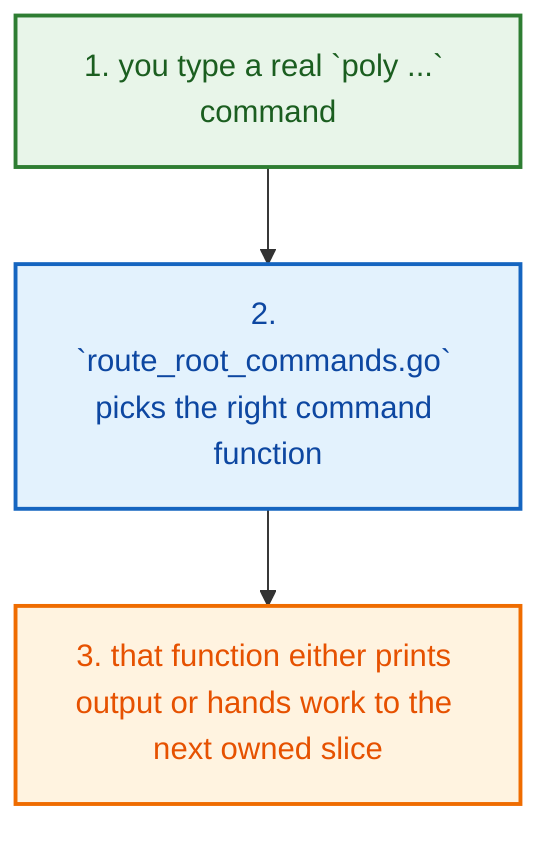

## The first important path

When you type:

```bash
poly new my-app --framework laravel
```

the important path is:

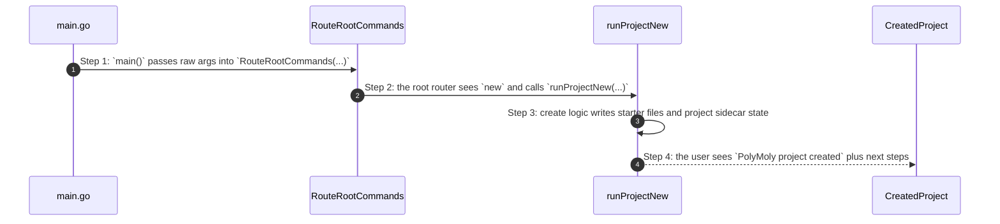

- **Step 1:** The CLI story begins in `main.go`, but the first real decision lives in `RouteRootCommands(...)`.
- **Step 2:** Once the router picks a command function, the story is much easier to follow.
- **Step 3:** If the wrong command wakes up, this folder is the first place to debug.
- **Step 4:** If the right command wakes up but later logic fails, the next folder in the handoff owns the deeper bug.

## Direct files in this folder

### `collect_wizard_answers.go`

This file is one direct stop in the story for this folder.

Why this name is honest:

- its main action is still visible in the code, starting with `writeWizardAnswers(...)`

When the story opens this file:

- when the `system/tools/poly/internal/cli/` story needs this responsibility, it opens `collect_wizard_answers.go`

What arrives here:

- caller-provided values from the parent flow

What leaves this file:

- the result of `writeWizardAnswers(...)` for the next caller
- a concrete return value, file write, check result, or summary depending on the path

Why you open it first:

- open this file when the symptom points to `writeWizardAnswers(...)` doing the wrong thing


- **Step 1:** The story reaches `collect_wizard_answers.go` because this file owns the next small responsibility.
- **Step 2:** The file does its own narrow action instead of mixing it into a bigger caller.
- **Step 3:** The next caller gets a concrete result, not another vague promise.

Important functions:

- `normalizeWizardMode(...)`
  Small helper for one narrow sub-step. It exists so the main path stays readable.
- `wizardAnswersFromIntent(...)`
  Small helper for one narrow sub-step. It exists so the main path stays readable.
- `loadWizardAnswers(...)`
  Small helper for one narrow sub-step. It exists so the main path stays readable.
- `writeWizardAnswers(...)`
  This is the main action in the file. It does the folder's primary job and returns the next concrete result.
- `promptWizardValue(...)`
  Small helper for one narrow sub-step. It exists so the main path stays readable.
- `promptWizardRuntime(...)`
  Small helper for one narrow sub-step. It exists so the main path stays readable.
- `promptWizardAnswers(...)`
  Small helper for one narrow sub-step. It exists so the main path stays readable.
- `buildIntentFromWizardAnswers(...)`
  Small helper for one narrow sub-step. It exists so the main path stays readable.

### `execute_migration_commands_test.go`

This test file locks one real behavior in this folder and fails loudly when that behavior drifts.

Why this name is honest:

- its main action is still visible in the code, starting with `TestRunMigratePlacementDryRunShowsReadyMove(...)`

When the story opens this file:

- when the `system/tools/poly/internal/cli/` story needs this responsibility, it opens `execute_migration_commands_test.go`

What arrives here:

- caller-provided values from the parent flow

What leaves this file:

- test proof for one regression shape
- clear failure when the behavior drifts

Why you open it first:

- a test case in this file is the fastest proof of the contract that drifted

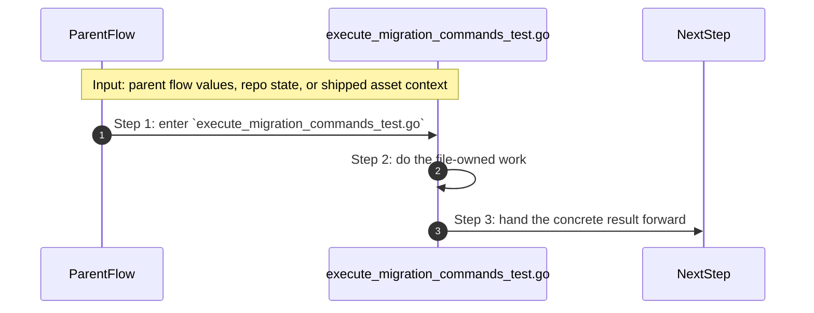

- **Step 1:** The story reaches `execute_migration_commands_test.go` because this file owns the next small responsibility.
- **Step 2:** The file does its own narrow action instead of mixing it into a bigger caller.
- **Step 3:** The next caller gets a concrete result, not another vague promise.

Important functions:

- `TestRunMigratePlacementDryRunShowsReadyMove(...)`
  One proof case in this file. It locks one expected behavior so a regression fails loudly.

### `execute_run_commands_test.go`

This test file locks one real behavior in this folder and fails loudly when that behavior drifts.

Why this name is honest:

- its main action is still visible in the code, starting with `TestPrintUsageShowsThinCoreByDefault(...)`

When the story opens this file:

- when the `system/tools/poly/internal/cli/` story needs this responsibility, it opens `execute_run_commands_test.go`

What arrives here:

- caller-provided values from the parent flow

What leaves this file:

- test proof for one regression shape
- clear failure when the behavior drifts

Why you open it first:

- a test case in this file is the fastest proof of the contract that drifted


- **Step 1:** The story reaches `execute_run_commands_test.go` because this file owns the next small responsibility.
- **Step 2:** The file does its own narrow action instead of mixing it into a bigger caller.
- **Step 3:** The next caller gets a concrete result, not another vague promise.

Important functions:

- `captureStdout(...)`
  Small helper for one narrow sub-step. It exists so the main path stays readable.
- `TestPrintUsageShowsThinCoreByDefault(...)`
  One proof case in this file. It locks one expected behavior so a regression fails loudly.
- `TestPrintUsageAllShowsAdvancedCatalog(...)`
  One proof case in this file. It locks one expected behavior so a regression fails loudly.

### `expand_variable_placeholders.go`

This file is one direct stop in the story for this folder.

Why this name is honest:

- its main action is still visible in the code, starting with `resolveSelfUpdateSourceBinary(...)`

When the story opens this file:

- when the `system/tools/poly/internal/cli/` story needs this responsibility, it opens `expand_variable_placeholders.go`

What arrives here:

- caller-provided values from the parent flow
- repo or project paths that tell the file where to read or write

What leaves this file:

- the result of `resolveSelfUpdateSourceBinary(...)` for the next caller
- a concrete return value, file write, check result, or summary depending on the path

Why you open it first:

- open this file when the symptom points to `resolveSelfUpdateSourceBinary(...)` doing the wrong thing

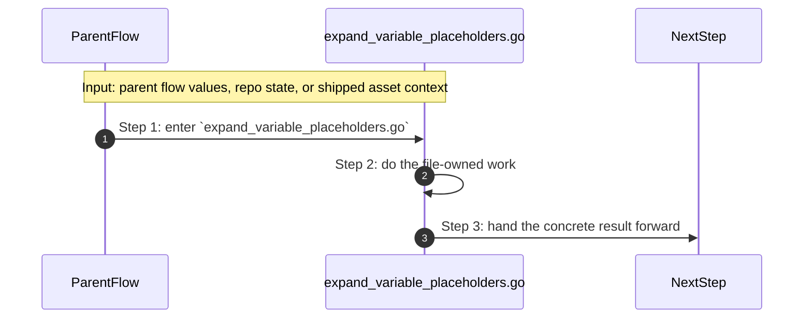

- **Step 1:** The story reaches `expand_variable_placeholders.go` because this file owns the next small responsibility.
- **Step 2:** The file does its own narrow action instead of mixing it into a bigger caller.
- **Step 3:** The next caller gets a concrete result, not another vague promise.

Important functions:

- `runInstall(...)`
  Small helper for one narrow sub-step. It exists so the main path stays readable.
- `runSelfUpdate(...)`
  Small helper for one narrow sub-step. It exists so the main path stays readable.
- `runTemplate(...)`
  Small helper for one narrow sub-step. It exists so the main path stays readable.
- `runTemplateSearch(...)`
  Small helper for one narrow sub-step. It exists so the main path stays readable.
- `runTemplateShow(...)`
  Small helper for one narrow sub-step. It exists so the main path stays readable.
- `runTemplateInstall(...)`
  Small helper for one narrow sub-step. It exists so the main path stays readable.
- `resolveTemplateDescriptorForCLI(...)`
  Small helper for one narrow sub-step. It exists so the main path stays readable.
- `resolveSelfUpdateSourceBinary(...)`
  This is the main action in the file. It does the folder's primary job and returns the next concrete result.
- `usableUpdateSource(...)`
  Small helper for one narrow sub-step. It exists so the main path stays readable.
- `sameExecutablePath(...)`
  Small helper for one narrow sub-step. It exists so the main path stays readable.
- `resolveTemplateIntentForCLI(...)`
  Small helper for one narrow sub-step. It exists so the main path stays readable.
- `normalizeComparableCLIVersion(...)`
  Small helper for one narrow sub-step. It exists so the main path stays readable.
- `runDashboard(...)`
  Small helper for one narrow sub-step. It exists so the main path stays readable.
- `runEnterprise(...)`
  Small helper for one narrow sub-step. It exists so the main path stays readable.
- `runEnterpriseSummary(...)`
  Small helper for one narrow sub-step. It exists so the main path stays readable.
- `runEnterpriseClusters(...)`
  Small helper for one narrow sub-step. It exists so the main path stays readable.
- `runEnterpriseAudit(...)`
  Small helper for one narrow sub-step. It exists so the main path stays readable.
- `runAI(...)`
  Small helper for one narrow sub-step. It exists so the main path stays readable.
- `currentProjectRoot(...)`
  Small helper for one narrow sub-step. It exists so the main path stays readable.

### `route_plugin_and_experience_commands.go`

This file is one direct stop in the story for this folder.

Why this name is honest:

- its main action is still visible in the code, starting with `mergePluginOverrides(...)`

When the story opens this file:

- when the `system/tools/poly/internal/cli/` story needs this responsibility, it opens `route_plugin_and_experience_commands.go`

What arrives here:

- caller-provided values from the parent flow
- repo or project paths that tell the file where to read or write

What leaves this file:

- the result of `mergePluginOverrides(...)` for the next caller
- a concrete return value, file write, check result, or summary depending on the path

Why you open it first:

- open this file when the symptom points to `mergePluginOverrides(...)` doing the wrong thing


- **Step 1:** The story reaches `route_plugin_and_experience_commands.go` because this file owns the next small responsibility.
- **Step 2:** The file does its own narrow action instead of mixing it into a bigger caller.
- **Step 3:** The next caller gets a concrete result, not another vague promise.

Important functions:

- `allKnownCommands(...)`
  Small helper for one narrow sub-step. It exists so the main path stays readable.
- `printUnknownCommand(...)`
  Small helper for one narrow sub-step. It exists so the main path stays readable.
- `resolveProjectRootForPlugins(...)`
  Small helper for one narrow sub-step. It exists so the main path stays readable.
- `runPluginBridge(...)`
  Small helper for one narrow sub-step. It exists so the main path stays readable.
- `runPlugin(...)`
  Small helper for one narrow sub-step. It exists so the main path stays readable.
- `runPluginSearch(...)`
  Small helper for one narrow sub-step. It exists so the main path stays readable.
- `runPluginInstall(...)`
  Small helper for one narrow sub-step. It exists so the main path stays readable.
- `runPluginList(...)`
  Small helper for one narrow sub-step. It exists so the main path stays readable.
- `runPluginUpdate(...)`
  Small helper for one narrow sub-step. It exists so the main path stays readable.
- `runPluginRemove(...)`
  Small helper for one narrow sub-step. It exists so the main path stays readable.
- `runHealth(...)`
  Small helper for one narrow sub-step. It exists so the main path stays readable.
- `runDemo(...)`
  Small helper for one narrow sub-step. It exists so the main path stays readable.
- `pluginHasLocalOverrides(...)`
  Small helper for one narrow sub-step. It exists so the main path stays readable.
- `mergePluginOverrides(...)`
  This is the main action in the file. It does the folder's primary job and returns the next concrete result.
- `sameStrings(...)`
  Small helper for one narrow sub-step. It exists so the main path stays readable.
- `demoRuntimeAvailable(...)`
  Small helper for one narrow sub-step. It exists so the main path stays readable.
- `runBlueprint(...)`
  Small helper for one narrow sub-step. It exists so the main path stays readable.
- `renderBlueprintMarkdown(...)`
  Small helper for one narrow sub-step. It exists so the main path stays readable.
- `deriveServiceDependencies(...)`
  Small helper for one narrow sub-step. It exists so the main path stays readable.
- `runOpen(...)`
  Small helper for one narrow sub-step. It exists so the main path stays readable.
- `buildRuntimeDelta(...)`
  Small helper for one narrow sub-step. It exists so the main path stays readable.
- `loadComposeRows(...)`
  Small helper for one narrow sub-step. It exists so the main path stays readable.
- `normalizeServiceName(...)`
  Small helper for one narrow sub-step. It exists so the main path stays readable.
- `renderRuntimeDeltaReport(...)`
  Small helper for one narrow sub-step. It exists so the main path stays readable.
- `csvValues(...)`
  Small helper for one narrow sub-step. It exists so the main path stays readable.

### `route_plugin_and_experience_commands_test.go`

This test file locks one real behavior in this folder and fails loudly when that behavior drifts.

Why this name is honest:

- its main action is still visible in the code, starting with `TestPrintUnknownCommandShowsFixHint(...)`

When the story opens this file:

- when the `system/tools/poly/internal/cli/` story needs this responsibility, it opens `route_plugin_and_experience_commands_test.go`

What arrives here:

- caller-provided values from the parent flow

What leaves this file:

- test proof for one regression shape
- clear failure when the behavior drifts

Why you open it first:

- a test case in this file is the fastest proof of the contract that drifted

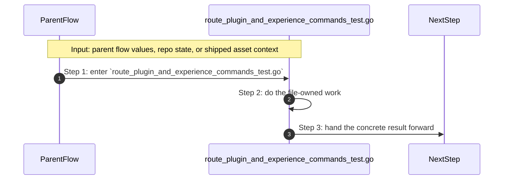

- **Step 1:** The story reaches `route_plugin_and_experience_commands_test.go` because this file owns the next small responsibility.
- **Step 2:** The file does its own narrow action instead of mixing it into a bigger caller.
- **Step 3:** The next caller gets a concrete result, not another vague promise.

Important functions:

- `captureStderr(...)`
  Small helper for one narrow sub-step. It exists so the main path stays readable.
- `TestPrintUnknownCommandShowsFixHint(...)`
  One proof case in this file. It locks one expected behavior so a regression fails loudly.
- `TestRunPluginBridgeUnmanagedFallback(...)`
  One proof case in this file. It locks one expected behavior so a regression fails loudly.
- `TestRenderRuntimeDeltaReport(...)`
  One proof case in this file. It locks one expected behavior so a regression fails loudly.
- `TestRunPluginBridgeFailsClosedOnLockError(...)`
  One proof case in this file. It locks one expected behavior so a regression fails loudly.
- `TestRunPluginInstallUnknownRegistryPluginFailsClearly(...)`
  One proof case in this file. It locks one expected behavior so a regression fails loudly.
- `TestRunPluginUpdateRequiresExplicitOverrideStrategy(...)`
  One proof case in this file. It locks one expected behavior so a regression fails loudly.
- `TestRunPluginUpdatePreservesOverridesWhenRequested(...)`
  One proof case in this file. It locks one expected behavior so a regression fails loudly.
- `TestRunDemoUsesShowcaseModeWhenProjectRuntimeContractIsMissing(...)`
  One proof case in this file. It locks one expected behavior so a regression fails loudly.
- `writePluginRegistry(...)`
  Small helper for one narrow sub-step. It exists so the main path stays readable.
- `writePluginProject(...)`
  Small helper for one narrow sub-step. It exists so the main path stays readable.

### `manage_developer_experience_test.go`

This test file locks one real behavior in this folder and fails loudly when that behavior drifts.

Why this name is honest:

- its main action is still visible in the code, starting with `TestRunCompletionBashIncludesNewCommands(...)`

When the story opens this file:

- when the `system/tools/poly/internal/cli/` story needs this responsibility, it opens `manage_developer_experience_test.go`

What arrives here:

- caller-provided values from the parent flow

What leaves this file:

- test proof for one regression shape
- clear failure when the behavior drifts

Why you open it first:

- a test case in this file is the fastest proof of the contract that drifted


- **Step 1:** The story reaches `manage_developer_experience_test.go` because this file owns the next small responsibility.
- **Step 2:** The file does its own narrow action instead of mixing it into a bigger caller.
- **Step 3:** The next caller gets a concrete result, not another vague promise.

Important functions:

- `TestRunCompletionBashIncludesNewCommands(...)`
  One proof case in this file. It locks one expected behavior so a regression fails loudly.
- `TestRunTutorialReferencesGoldenPathCommands(...)`
  One proof case in this file. It locks one expected behavior so a regression fails loudly.
- `TestCollectRuntimeEventsIncludesPendingPlan(...)`
  One proof case in this file. It locks one expected behavior so a regression fails loudly.
- `TestRunProjectMetricsJSONWorksWithoutLiveRuntime(...)`
  One proof case in this file. It locks one expected behavior so a regression fails loudly.
- `TestRunProjectEventsPrintsTimeline(...)`
  One proof case in this file. It locks one expected behavior so a regression fails loudly.
- `TestRunProjectServicesWarnsForUnknownRuntimeMarkers(...)`
  One proof case in this file. It locks one expected behavior so a regression fails loudly.

### `manage_product_commands_test.go`

This test file locks one real behavior in this folder and fails loudly when that behavior drifts.

Why this name is honest:

- its main action is still visible in the code, starting with `TestKeepOnlyExplicitTemplateOverridesPreservesOnlyExplicitFields(...)`

When the story opens this file:

- when the `system/tools/poly/internal/cli/` story needs this responsibility, it opens `manage_product_commands_test.go`

What arrives here:

- caller-provided values from the parent flow

What leaves this file:

- test proof for one regression shape
- clear failure when the behavior drifts

Why you open it first:

- a test case in this file is the fastest proof of the contract that drifted

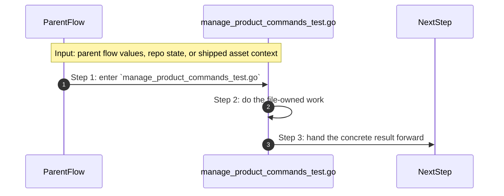

- **Step 1:** The story reaches `manage_product_commands_test.go` because this file owns the next small responsibility.
- **Step 2:** The file does its own narrow action instead of mixing it into a bigger caller.
- **Step 3:** The next caller gets a concrete result, not another vague promise.

Important functions:

- `withWorkingDir(...)`
  Small helper for one narrow sub-step. It exists so the main path stays readable.
- `withNonInteractiveStdin(...)`
  Small helper for one narrow sub-step. It exists so the main path stays readable.
- `writeStarterFixtures(...)`
  Small helper for one narrow sub-step. It exists so the main path stays readable.
- `TestKeepOnlyExplicitTemplateOverridesPreservesOnlyExplicitFields(...)`
  One proof case in this file. It locks one expected behavior so a regression fails loudly.
- `TestApplyConfigurationMutationsRejectsDatabaseNoneWithMode(...)`
  One proof case in this file. It locks one expected behavior so a regression fails loudly.
- `TestApplyConfigurationMutationsRejectsDatabaseModeWithoutDatabaseService(...)`
  One proof case in this file. It locks one expected behavior so a regression fails loudly.
- `TestResolveVerifyRunnerArgs(...)`
  One proof case in this file. It locks one expected behavior so a regression fails loudly.
- `TestEnsureEmptyOrReplaceRequiresExplicitReplace(...)`
  One proof case in this file. It locks one expected behavior so a regression fails loudly.
- `TestEnsureEmptyOrReplacePrintsDeterministicCleanupAndPreservesSidecar(...)`
  One proof case in this file. It locks one expected behavior so a regression fails loudly.
- `TestApplyPendingPlanRejectsStaleBaselineByDefault(...)`
  One proof case in this file. It locks one expected behavior so a regression fails loudly.
- `TestApplyPendingPlanAllowsStaleOnlyWithExplicitUnsafeOverride(...)`
  One proof case in this file. It locks one expected behavior so a regression fails loudly.
- `TestRuntimeDeltaHasDrift(...)`
  One proof case in this file. It locks one expected behavior so a regression fails loudly.
- `TestParseSetMutationsSupportsCanonicalKeys(...)`
  One proof case in this file. It locks one expected behavior so a regression fails loudly.
- `TestReorderLeadingPositionalsMovesNameAheadOfFlagsParser(...)`
  One proof case in this file. It locks one expected behavior so a regression fails loudly.
- `TestInferRuntimeFromFrameworkDeterministic(...)`
  One proof case in this file. It locks one expected behavior so a regression fails loudly.
- `TestRunProjectNewRequiresRuntimeGuidanceInNonTTY(...)`
  One proof case in this file. It locks one expected behavior so a regression fails loudly.
- `TestRunProjectNewInfersRuntimeFromFramework(...)`
  One proof case in this file. It locks one expected behavior so a regression fails loudly.
- `TestRunProjectNewExplicitRuntimeOverridesFrameworkInference(...)`
  One proof case in this file. It locks one expected behavior so a regression fails loudly.
- `TestParseAddServiceShorthandsSupportsKnownServiceShorthands(...)`
  One proof case in this file. It locks one expected behavior so a regression fails loudly.
- `TestRunProjectAddUsesMutationPlanContract(...)`
  One proof case in this file. It locks one expected behavior so a regression fails loudly.
- `TestRunProjectReplacePreservesSidecarAndCreatesBackup(...)`
  One proof case in this file. It locks one expected behavior so a regression fails loudly.
- `TestRunProjectWizardPreviewSupportsAnswersFile(...)`
  One proof case in this file. It locks one expected behavior so a regression fails loudly.
- `TestRunProjectEditPreviewSupportsAnswersFile(...)`
  One proof case in this file. It locks one expected behavior so a regression fails loudly.
- `TestRunProjectPlanJSONIncludesSummary(...)`
  One proof case in this file. It locks one expected behavior so a regression fails loudly.
- `TestRunProjectInitMigratesLegacyProject(...)`
  One proof case in this file. It locks one expected behavior so a regression fails loudly.
- `TestRunTemplateInstallRejectsTemplateWhenMinCLIIsTooNew(...)`
  One proof case in this file. It locks one expected behavior so a regression fails loudly.
- `TestPrepareInitialIntentRejectsTemplateWhenMinCLIIsTooNew(...)`
  One proof case in this file. It locks one expected behavior so a regression fails loudly.

### `manage_runtime_commands_test.go`

This test file locks one real behavior in this folder and fails loudly when that behavior drifts.

Why this name is honest:

- its main action is still visible in the code, starting with `TestSmartWatchNudgesHonorsBudget(...)`

When the story opens this file:

- when the `system/tools/poly/internal/cli/` story needs this responsibility, it opens `manage_runtime_commands_test.go`

What arrives here:

- caller-provided values from the parent flow

What leaves this file:

- test proof for one regression shape
- clear failure when the behavior drifts

Why you open it first:

- a test case in this file is the fastest proof of the contract that drifted

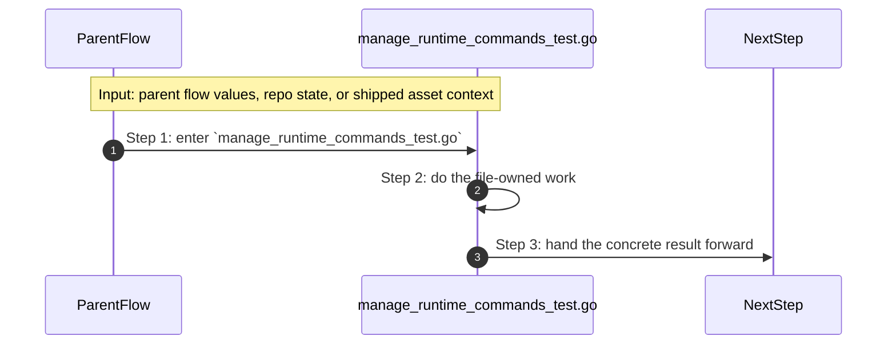

- **Step 1:** The story reaches `manage_runtime_commands_test.go` because this file owns the next small responsibility.
- **Step 2:** The file does its own narrow action instead of mixing it into a bigger caller.
- **Step 3:** The next caller gets a concrete result, not another vague promise.

Important functions:

- `TestSmartWatchNudgesHonorsBudget(...)`
  One proof case in this file. It locks one expected behavior so a regression fails loudly.
- `TestEvaluateChaosSimulationIncludesConfidenceAndAssumptions(...)`
  One proof case in this file. It locks one expected behavior so a regression fails loudly.

### `orchestrate_argocd_operations_test.go`

This test file locks one real behavior in this folder and fails loudly when that behavior drifts.

Why this name is honest:

- its main action is still visible in the code, starting with `TestWriteArgoEvidence(...)`

When the story opens this file:

- when the `system/tools/poly/internal/cli/` story needs this responsibility, it opens `orchestrate_argocd_operations_test.go`

What arrives here:

- caller-provided values from the parent flow

What leaves this file:

- test proof for one regression shape
- clear failure when the behavior drifts

Why you open it first:

- a test case in this file is the fastest proof of the contract that drifted


- **Step 1:** The story reaches `orchestrate_argocd_operations_test.go` because this file owns the next small responsibility.
- **Step 2:** The file does its own narrow action instead of mixing it into a bigger caller.
- **Step 3:** The next caller gets a concrete result, not another vague promise.

Important functions:

- `TestWriteArgoEvidence(...)`
  One proof case in this file. It locks one expected behavior so a regression fails loudly.

### `render_cli_user_interface.go`

This file is one direct stop in the story for this folder.

Why this name is honest:

- its main action is still visible in the code, starting with `configureSessionOptions(...)`

When the story opens this file:

- when the `system/tools/poly/internal/cli/` story needs this responsibility, it opens `render_cli_user_interface.go`

What arrives here:

- caller-provided values from the parent flow
- config or model values that need to be normalized, rendered, or checked

What leaves this file:

- the result of `configureSessionOptions(...)` for the next caller
- a concrete return value, file write, check result, or summary depending on the path

Why you open it first:

- open this file when the symptom points to `configureSessionOptions(...)` doing the wrong thing

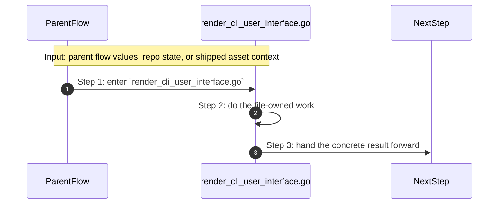

- **Step 1:** The story reaches `render_cli_user_interface.go` because this file owns the next small responsibility.
- **Step 2:** The file does its own narrow action instead of mixing it into a bigger caller.
- **Step 3:** The next caller gets a concrete result, not another vague promise.

Important functions:

- `configureSessionOptions(...)`
  This is the main action in the file. It does the folder's primary job and returns the next concrete result.
- `hintsEnabled(...)`
  Small helper for one narrow sub-step. It exists so the main path stays readable.
- `debugEnabled(...)`
  Small helper for one narrow sub-step. It exists so the main path stays readable.
- `printDebugf(...)`
  Small helper for one narrow sub-step. It exists so the main path stays readable.
- `printSection(...)`
  Small helper for one narrow sub-step. It exists so the main path stays readable.
- `printKeyValue(...)`
  Small helper for one narrow sub-step. It exists so the main path stays readable.
- `printNextSteps(...)`
  Small helper for one narrow sub-step. It exists so the main path stays readable.
- `printFixSuggestions(...)`
  Small helper for one narrow sub-step. It exists so the main path stays readable.

### `resolve_cli_runtime.go`

This file is one direct stop in the story for this folder.

Why this name is honest:

- its main action is still visible in the code, starting with `resolveCommandRoot(...)`

When the story opens this file:

- when the `system/tools/poly/internal/cli/` story needs this responsibility, it opens `resolve_cli_runtime.go`

What arrives here:

- caller-provided values from the parent flow
- repo or project paths that tell the file where to read or write

What leaves this file:

- the result of `resolveCommandRoot(...)` for the next caller
- a concrete return value, file write, check result, or summary depending on the path

Why you open it first:

- open this file when the symptom points to `resolveCommandRoot(...)` doing the wrong thing

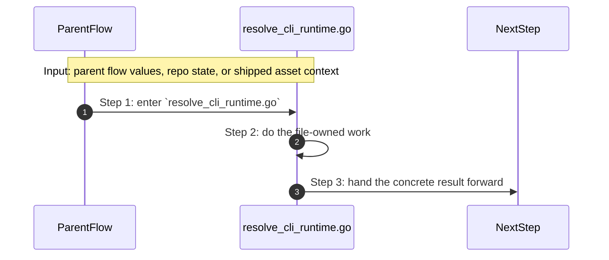

- **Step 1:** The story reaches `resolve_cli_runtime.go` because this file owns the next small responsibility.
- **Step 2:** The file does its own narrow action instead of mixing it into a bigger caller.
- **Step 3:** The next caller gets a concrete result, not another vague promise.

Important functions:

- `resolveCommandRoot(...)`
  This is the main action in the file. It does the folder's primary job and returns the next concrete result.
- `commandNeedsRepoRoot(...)`
  Small helper for one narrow sub-step. It exists so the main path stays readable.
- `resolveProjectLocalSourceRoot(...)`
  Small helper for one narrow sub-step. It exists so the main path stays readable.
- `resolveProjectLocalSourceRootFromExecutable(...)`
  Small helper for one narrow sub-step. It exists so the main path stays readable.

### `resolve_cli_runtime_test.go`

This test file locks one real behavior in this folder and fails loudly when that behavior drifts.

Why this name is honest:

- its main action is still visible in the code, starting with `TestRunVersionDoesNotRequireRepoRoot(...)`

When the story opens this file:

- when the `system/tools/poly/internal/cli/` story needs this responsibility, it opens `resolve_cli_runtime_test.go`

What arrives here:

- caller-provided values from the parent flow
- repo or project paths that tell the file where to read or write

What leaves this file:

- test proof for one regression shape
- clear failure when the behavior drifts

Why you open it first:

- a test case in this file is the fastest proof of the contract that drifted


- **Step 1:** The story reaches `resolve_cli_runtime_test.go` because this file owns the next small responsibility.
- **Step 2:** The file does its own narrow action instead of mixing it into a bigger caller.
- **Step 3:** The next caller gets a concrete result, not another vague promise.

Important functions:

- `TestRunVersionDoesNotRequireRepoRoot(...)`
  One proof case in this file. It locks one expected behavior so a regression fails loudly.
- `TestResolveProjectLocalSourceRootFromExecutable(...)`
  One proof case in this file. It locks one expected behavior so a regression fails loudly.
- `TestResolveProjectLocalSourceRootRejectsMissingSourceRoot(...)`
  One proof case in this file. It locks one expected behavior so a regression fails loudly.

### `route_argocd_commands.go`

This file is one direct stop in the story for this folder.

Why this name is honest:

- its main action is still visible in the code, starting with `runArgoCD(...)`

When the story opens this file:

- when the `system/tools/poly/internal/cli/` story needs this responsibility, it opens `route_argocd_commands.go`

What arrives here:

- caller-provided values from the parent flow

What leaves this file:

- the result of `runArgoCD(...)` for the next caller
- a concrete return value, file write, check result, or summary depending on the path

Why you open it first:

- open this file when the symptom points to `runArgoCD(...)` doing the wrong thing

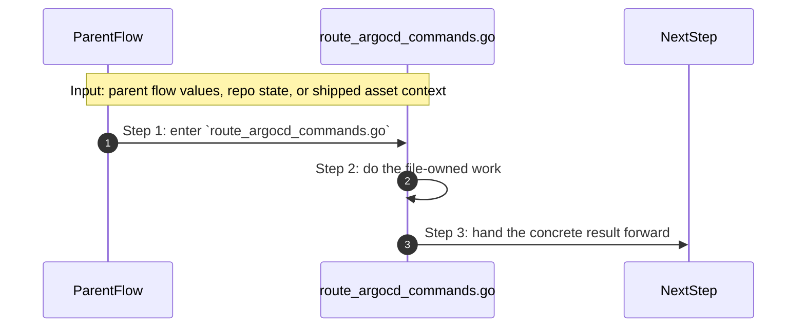

- **Step 1:** The story reaches `route_argocd_commands.go` because this file owns the next small responsibility.
- **Step 2:** The file does its own narrow action instead of mixing it into a bigger caller.
- **Step 3:** The next caller gets a concrete result, not another vague promise.

Important functions:

- `runArgoCD(...)`
  This is the main action in the file. It does the folder's primary job and returns the next concrete result.
- `runArgoCDRepoLock(...)`
  Small helper for one narrow sub-step. It exists so the main path stays readable.
- `runArgoCDRepoBridge(...)`
  Small helper for one narrow sub-step. It exists so the main path stays readable.
- `runArgoCDBootstrap(...)`
  Small helper for one narrow sub-step. It exists so the main path stays readable.
- `runArgoCDWait(...)`
  Small helper for one narrow sub-step. It exists so the main path stays readable.
- `runArgoCDRollbackProof(...)`
  Small helper for one narrow sub-step. It exists so the main path stays readable.
- `runArgoCDPromote(...)`
  Small helper for one narrow sub-step. It exists so the main path stays readable.
- `blankString(...)`
  Small helper for one narrow sub-step. It exists so the main path stays readable.
- `stringsJoin(...)`
  Small helper for one narrow sub-step. It exists so the main path stays readable.
- `stringsTrimPrefix(...)`
  Small helper for one narrow sub-step. It exists so the main path stays readable.
- `writeArgoEvidence(...)`
  Small helper for one narrow sub-step. It exists so the main path stays readable.

### `route_developer_experience_commands.go`

This file is one direct stop in the story for this folder.

Why this name is honest:

- its main action is still visible in the code, starting with `renderCacheStatus(...)`

When the story opens this file:

- when the `system/tools/poly/internal/cli/` story needs this responsibility, it opens `route_developer_experience_commands.go`

What arrives here:

- caller-provided values from the parent flow

What leaves this file:

- the result of `renderCacheStatus(...)` for the next caller
- a concrete return value, file write, check result, or summary depending on the path

Why you open it first:

- open this file when the symptom points to `renderCacheStatus(...)` doing the wrong thing

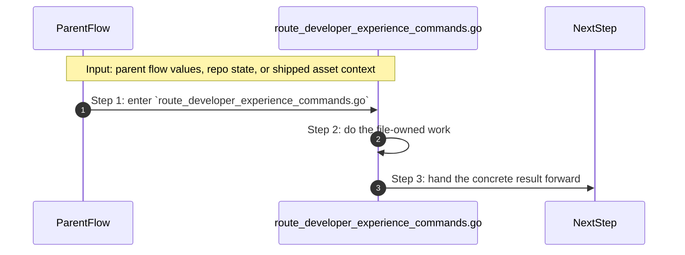

- **Step 1:** The story reaches `route_developer_experience_commands.go` because this file owns the next small responsibility.
- **Step 2:** The file does its own narrow action instead of mixing it into a bigger caller.
- **Step 3:** The next caller gets a concrete result, not another vague promise.

Important functions:

- `runCache(...)`
  Small helper for one narrow sub-step. It exists so the main path stays readable.
- `renderCacheStatus(...)`
  This is the main action in the file. It does the folder's primary job and returns the next concrete result.
- `runCompletion(...)`
  Small helper for one narrow sub-step. It exists so the main path stays readable.
- `runTutorial(...)`
  Small helper for one narrow sub-step. It exists so the main path stays readable.

### `route_migration_commands.go`

This file is one direct stop in the story for this folder.

Why this name is honest:

- its main action is still visible in the code, starting with `runMigrate(...)`

When the story opens this file:

- when the `system/tools/poly/internal/cli/` story needs this responsibility, it opens `route_migration_commands.go`

What arrives here:

- caller-provided values from the parent flow

What leaves this file:

- the result of `runMigrate(...)` for the next caller
- a concrete return value, file write, check result, or summary depending on the path

Why you open it first:

- open this file when the symptom points to `runMigrate(...)` doing the wrong thing

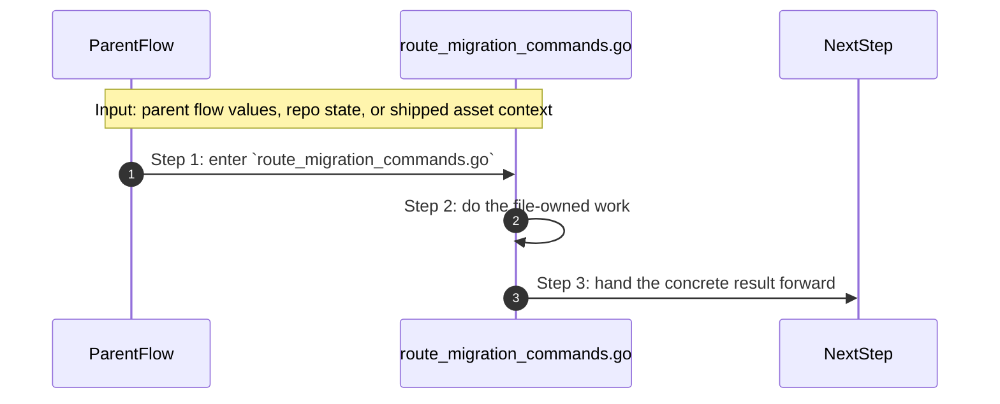

- **Step 1:** The story reaches `route_migration_commands.go` because this file owns the next small responsibility.
- **Step 2:** The file does its own narrow action instead of mixing it into a bigger caller.
- **Step 3:** The next caller gets a concrete result, not another vague promise.

Important functions:

- `runMigrate(...)`
  This is the main action in the file. It does the folder's primary job and returns the next concrete result.
- `runMigratePlacement(...)`
  Small helper for one narrow sub-step. It exists so the main path stays readable.
- `runMigrateRewrite(...)`
  Small helper for one narrow sub-step. It exists so the main path stays readable.
- `runMigrateShims(...)`
  Small helper for one narrow sub-step. It exists so the main path stays readable.
- `printMigrationReport(...)`
  Small helper for one narrow sub-step. It exists so the main path stays readable.
- `printRewriteReport(...)`
  Small helper for one narrow sub-step. It exists so the main path stays readable.
- `printShimReport(...)`
  Small helper for one narrow sub-step. It exists so the main path stays readable.
- `ternary(...)`
  Small helper for one narrow sub-step. It exists so the main path stays readable.

### `route_operator_commands.go`

This file is one direct stop in the story for this folder.

Why this name is honest:

- its main action is still visible in the code, starting with `runBackup(...)`

When the story opens this file:

- when the `system/tools/poly/internal/cli/` story needs this responsibility, it opens `route_operator_commands.go`

What arrives here:

- caller-provided values from the parent flow

What leaves this file:

- the result of `runBackup(...)` for the next caller
- a concrete return value, file write, check result, or summary depending on the path

Why you open it first:

- open this file when the symptom points to `runBackup(...)` doing the wrong thing

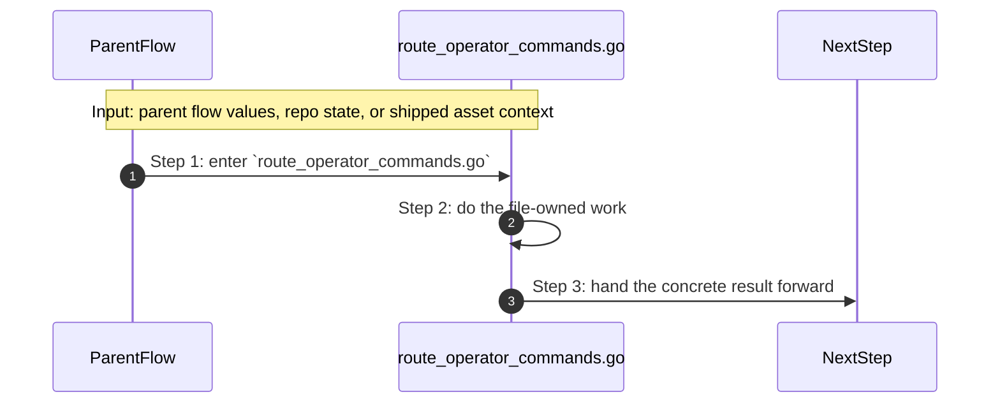

- **Step 1:** The story reaches `route_operator_commands.go` because this file owns the next small responsibility.
- **Step 2:** The file does its own narrow action instead of mixing it into a bigger caller.
- **Step 3:** The next caller gets a concrete result, not another vague promise.

Important functions:

- `runTLS(...)`
  Small helper for one narrow sub-step. It exists so the main path stays readable.
- `runToolbox(...)`
  Small helper for one narrow sub-step. It exists so the main path stays readable.
- `runPerformance(...)`
  Small helper for one narrow sub-step. It exists so the main path stays readable.
- `runResilience(...)`
  Small helper for one narrow sub-step. It exists so the main path stays readable.
- `runRelease(...)`
  Small helper for one narrow sub-step. It exists so the main path stays readable.
- `runSecurity(...)`
  Small helper for one narrow sub-step. It exists so the main path stays readable.
- `runSecrets(...)`
  Small helper for one narrow sub-step. It exists so the main path stays readable.
- `runFinOps(...)`
  Small helper for one narrow sub-step. It exists so the main path stays readable.
- `runBackup(...)`
  This is the main action in the file. It does the folder's primary job and returns the next concrete result.

### `route_project_commands.go`

This file is one direct stop in the story for this folder.

Why this name is honest:

- its main action is still visible in the code, starting with `runProjectNew(...)`

When the story opens this file:

- when the `system/tools/poly/internal/cli/` story needs this responsibility, it opens `route_project_commands.go`

What arrives here:

- caller-provided values from the parent flow
- repo or project paths that tell the file where to read or write

What leaves this file:

- the result of `runProjectNew(...)` for the next caller
- a concrete return value, file write, check result, or summary depending on the path

Why you open it first:

- open this file when the symptom points to `runProjectNew(...)` doing the wrong thing


- **Step 1:** The story reaches `route_project_commands.go` because this file owns the next small responsibility.
- **Step 2:** The file does its own narrow action instead of mixing it into a bigger caller.
- **Step 3:** The next caller gets a concrete result, not another vague promise.

Important functions:

- `runProjectNew(...)`
  This is the main action in the file. It does the folder's primary job and returns the next concrete result.
- `runProjectInit(...)`
  Small helper for one narrow sub-step. It exists so the main path stays readable.
- `runProjectWizard(...)`
  Small helper for one narrow sub-step. It exists so the main path stays readable.
- `runProjectEdit(...)`
  Small helper for one narrow sub-step. It exists so the main path stays readable.
- `runProjectSet(...)`
  Small helper for one narrow sub-step. It exists so the main path stays readable.
- `runProjectAdd(...)`
  Small helper for one narrow sub-step. It exists so the main path stays readable.
- `runProjectReplace(...)`
  Small helper for one narrow sub-step. It exists so the main path stays readable.
- `runProjectConfigure(...)`
  Small helper for one narrow sub-step. It exists so the main path stays readable.
- `runProjectPlan(...)`
  Small helper for one narrow sub-step. It exists so the main path stays readable.
- `runProjectDiff(...)`
  Small helper for one narrow sub-step. It exists so the main path stays readable.
- `runtimeDeltaHasDrift(...)`
  Small helper for one narrow sub-step. It exists so the main path stays readable.
- `runProjectApply(...)`
  Small helper for one narrow sub-step. It exists so the main path stays readable.
- `runProjectGhost(...)`
  Small helper for one narrow sub-step. It exists so the main path stays readable.
- `runProjectChaos(...)`
  Small helper for one narrow sub-step. It exists so the main path stays readable.
- `runProjectList(...)`
  Small helper for one narrow sub-step. It exists so the main path stays readable.
- `runProjectDescribe(...)`
  Small helper for one narrow sub-step. It exists so the main path stays readable.
- `runVerify(...)`
  Small helper for one narrow sub-step. It exists so the main path stays readable.
- `resolveVerifyRunnerArgs(...)`
  Small helper for one narrow sub-step. It exists so the main path stays readable.
- `buildInitialIntent(...)`
  Small helper for one narrow sub-step. It exists so the main path stays readable.
- `keepOnlyExplicitTemplateOverrides(...)`
  Small helper for one narrow sub-step. It exists so the main path stays readable.
- `applyConfigurationMutations(...)`
  Small helper for one narrow sub-step. It exists so the main path stays readable.
- `loadProjectOrDefault(...)`
  Small helper for one narrow sub-step. It exists so the main path stays readable.
- `applyPendingPlan(...)`
  Small helper for one narrow sub-step. It exists so the main path stays readable.
- `executeMutationPlan(...)`
  Small helper for one narrow sub-step. It exists so the main path stays readable.
- `executeProjectMutation(...)`
  Small helper for one narrow sub-step. It exists so the main path stays readable.
- `printRuntimeReadySummary(...)`
  Small helper for one narrow sub-step. It exists so the main path stays readable.
- `printRuntimeReadySummaryFromIntent(...)`
  Small helper for one narrow sub-step. It exists so the main path stays readable.
- `printRiskNudges(...)`
  Small helper for one narrow sub-step. It exists so the main path stays readable.
- `resolveScaffoldRuntime(...)`
  Small helper for one narrow sub-step. It exists so the main path stays readable.
- `normalizeFrameworkHint(...)`
  Small helper for one narrow sub-step. It exists so the main path stays readable.
- `inferRuntimeFromFramework(...)`
  Small helper for one narrow sub-step. It exists so the main path stays readable.
- `supportedFrameworkHints(...)`
  Small helper for one narrow sub-step. It exists so the main path stays readable.
- `frameworkMatrix(...)`
  Small helper for one narrow sub-step. It exists so the main path stays readable.
- `scaffoldNextSteps(...)`
  Small helper for one narrow sub-step. It exists so the main path stays readable.
- `evaluateChaosSimulation(...)`
  Small helper for one narrow sub-step. It exists so the main path stays readable.
- `printChaosSimulation(...)`
  Small helper for one narrow sub-step. It exists so the main path stays readable.
- `detectServiceProvider(...)`
  Small helper for one narrow sub-step. It exists so the main path stays readable.
- `detectServiceMode(...)`
  Small helper for one narrow sub-step. It exists so the main path stays readable.
- `promptValue(...)`
  Small helper for one narrow sub-step. It exists so the main path stays readable.
- `promptRuntimeSelection(...)`
  Small helper for one narrow sub-step. It exists so the main path stays readable.
- `stdinInteractive(...)`
  Small helper for one narrow sub-step. It exists so the main path stays readable.
- `confirm(...)`
  Small helper for one narrow sub-step. It exists so the main path stays readable.
- `parseSetMutations(...)`
  Small helper for one narrow sub-step. It exists so the main path stays readable.
- `parseAddServiceShorthands(...)`
  Small helper for one narrow sub-step. It exists so the main path stays readable.
- `printProfileUpgradeSummary(...)`
  Small helper for one narrow sub-step. It exists so the main path stays readable.
- `printFileList(...)`
  Small helper for one narrow sub-step. It exists so the main path stays readable.
- `prepareReplacePreview(...)`
  Small helper for one narrow sub-step. It exists so the main path stays readable.
- `replaceScaffold(...)`
  Small helper for one narrow sub-step. It exists so the main path stays readable.
- `expectedStarterFiles(...)`
  Small helper for one narrow sub-step. It exists so the main path stays readable.
- `copyTree(...)`
  Small helper for one narrow sub-step. It exists so the main path stays readable.
- `reorderLeadingPositionals(...)`
  Small helper for one narrow sub-step. It exists so the main path stays readable.
- `hasMutationFlag(...)`
  Small helper for one narrow sub-step. It exists so the main path stays readable.
- `writeStarter(...)`
  Small helper for one narrow sub-step. It exists so the main path stays readable.
- `copyFile(...)`
  Small helper for one narrow sub-step. It exists so the main path stays readable.
- `ensureEmptyOrReplace(...)`
  Small helper for one narrow sub-step. It exists so the main path stays readable.
- `flagWasSet(...)`
  Small helper for one narrow sub-step. It exists so the main path stays readable.
- `padRight(...)`
  Small helper for one narrow sub-step. It exists so the main path stays readable.

### `route_root_commands.go`

This file is one direct stop in the story for this folder.

Why this name is honest:

- its main action is still visible in the code, starting with `RouteRootCommands(...)`

When the story opens this file:

- when the `system/tools/poly/internal/cli/` story needs this responsibility, it opens `route_root_commands.go`

What arrives here:

- caller-provided values from the parent flow
- repo or project paths that tell the file where to read or write

What leaves this file:

- the result of `RouteRootCommands(...)` for the next caller
- a concrete return value, file write, check result, or summary depending on the path

Why you open it first:

- open this file when the symptom points to `RouteRootCommands(...)` doing the wrong thing

```mermaid
sequenceDiagram
    autonumber
    participant Caller as ParentFlow
    participant File as route_root_commands.go
    participant Next as NextStep

    Note over Caller,File: Input: parent flow values, repo state, or shipped asset context
    Caller->>File: Step 1: enter `route_root_commands.go`
    File->>File: Step 2: do the file-owned work
    File->>Next: Step 3: hand the concrete result forward
```

- **Step 1:** The story reaches `route_root_commands.go` because this file owns the next small responsibility.
- **Step 2:** The file does its own narrow action instead of mixing it into a bigger caller.
- **Step 3:** The next caller gets a concrete result, not another vague promise.

Important functions:

- `RouteRootCommands(...)`
  This is the main action in the file. It does the folder's primary job and returns the next concrete result.
- `runEnv(...)`
  Small helper for one narrow sub-step. It exists so the main path stays readable.
- `runGate(...)`
  Small helper for one narrow sub-step. It exists so the main path stays readable.
- `runGateSummary(...)`
  Small helper for one narrow sub-step. It exists so the main path stays readable.
- `runGateCheck(...)`
  Small helper for one narrow sub-step. It exists so the main path stays readable.
- `runExternal(...)`
  Small helper for one narrow sub-step. It exists so the main path stays readable.
- `runHelp(...)`
  Small helper for one narrow sub-step. It exists so the main path stays readable.
- `printUsage(...)`
  Small helper for one narrow sub-step. It exists so the main path stays readable.
- `printUsageAll(...)`
  Small helper for one narrow sub-step. It exists so the main path stays readable.
- `runPlatform(...)`
  Small helper for one narrow sub-step. It exists so the main path stays readable.
- `runHosts(...)`
  Small helper for one narrow sub-step. It exists so the main path stays readable.
- `runDocs(...)`
  Small helper for one narrow sub-step. It exists so the main path stays readable.
- `runReview(...)`
  Small helper for one narrow sub-step. It exists so the main path stays readable.
- `runLock(...)`
  Small helper for one narrow sub-step. It exists so the main path stays readable.
- `runBacklog(...)`
  Small helper for one narrow sub-step. It exists so the main path stays readable.
- `csvSet(...)`
  Small helper for one narrow sub-step. It exists so the main path stays readable.

### `route_runtime_commands.go`

This file is one direct stop in the story for this folder.

Why this name is honest:

- its main action is still visible in the code, starting with `collectRuntimeEvents(...)`

When the story opens this file:

- when the `system/tools/poly/internal/cli/` story needs this responsibility, it opens `route_runtime_commands.go`

What arrives here:

- caller-provided values from the parent flow

What leaves this file:

- the result of `collectRuntimeEvents(...)` for the next caller
- a concrete return value, file write, check result, or summary depending on the path

Why you open it first:

- open this file when the symptom points to `collectRuntimeEvents(...)` doing the wrong thing

```mermaid
sequenceDiagram
    autonumber
    participant Caller as ParentFlow
    participant File as route_runtime_commands.go
    participant Next as NextStep

    Note over Caller,File: Input: parent flow values, repo state, or shipped asset context
    Caller->>File: Step 1: enter `route_runtime_commands.go`
    File->>File: Step 2: do the file-owned work
    File->>Next: Step 3: hand the concrete result forward
```

- **Step 1:** The story reaches `route_runtime_commands.go` because this file owns the next small responsibility.
- **Step 2:** The file does its own narrow action instead of mixing it into a bigger caller.
- **Step 3:** The next caller gets a concrete result, not another vague promise.

Important functions:

- `runRuntimeCommand(...)`
  Small helper for one narrow sub-step. It exists so the main path stays readable.
- `runDoctor(...)`
  Small helper for one narrow sub-step. It exists so the main path stays readable.
- `runStart(...)`
  Small helper for one narrow sub-step. It exists so the main path stays readable.
- `runUp(...)`
  Small helper for one narrow sub-step. It exists so the main path stays readable.
- `runDown(...)`
  Small helper for one narrow sub-step. It exists so the main path stays readable.
- `runStatus(...)`
  Small helper for one narrow sub-step. It exists so the main path stays readable.
- `runLogs(...)`
  Small helper for one narrow sub-step. It exists so the main path stays readable.
- `runProjectHistory(...)`
  Small helper for one narrow sub-step. It exists so the main path stays readable.
- `runProjectExplain(...)`
  Small helper for one narrow sub-step. It exists so the main path stays readable.
- `runProjectServices(...)`
  Small helper for one narrow sub-step. It exists so the main path stays readable.
- `runProjectGraph(...)`
  Small helper for one narrow sub-step. It exists so the main path stays readable.
- `runProjectImpact(...)`
  Small helper for one narrow sub-step. It exists so the main path stays readable.
- `runProjectWatch(...)`
  Small helper for one narrow sub-step. It exists so the main path stays readable.
- `smartWatchNudges(...)`
  Small helper for one narrow sub-step. It exists so the main path stays readable.
- `runProjectEvents(...)`
  Small helper for one narrow sub-step. It exists so the main path stays readable.
- `runProjectMetrics(...)`
  Small helper for one narrow sub-step. It exists so the main path stays readable.
- `runEnvInit(...)`
  Small helper for one narrow sub-step. It exists so the main path stays readable.
- `runCommand(...)`
  Small helper for one narrow sub-step. It exists so the main path stays readable.
- `renderIntentServiceSummary(...)`
  Small helper for one narrow sub-step. It exists so the main path stays readable.
- `serviceSelectionList(...)`
  Small helper for one narrow sub-step. It exists so the main path stays readable.
- `promptServiceSelection(...)`
  Small helper for one narrow sub-step. It exists so the main path stays readable.
- `explainReasons(...)`
  Small helper for one narrow sub-step. It exists so the main path stays readable.
- `collectExplainableTargets(...)`
  Small helper for one narrow sub-step. It exists so the main path stays readable.
- `isExplainableTarget(...)`
  Small helper for one narrow sub-step. It exists so the main path stays readable.
- `impactedServices(...)`
  Small helper for one narrow sub-step. It exists so the main path stays readable.
- `trimForHistory(...)`
  Small helper for one narrow sub-step. It exists so the main path stays readable.
- `printRuntimeDiscoverySummary(...)`
  Small helper for one narrow sub-step. It exists so the main path stays readable.
- `collectRuntimeEvents(...)`
  This is the main action in the file. It does the folder's primary job and returns the next concrete result.
- `buildRuntimeMetrics(...)`
  Small helper for one narrow sub-step. It exists so the main path stays readable.
- `writeFiveMinuteWinEvidence(...)`
  Small helper for one narrow sub-step. It exists so the main path stays readable.

## Child folders in this folder

This folder has no child folders in scope.

## Debug first

- start with `writeWizardAnswers(...)` in `collect_wizard_answers.go` when that action looks wrong
- start with `TestRunMigratePlacementDryRunShowsReadyMove(...)` in `execute_migration_commands_test.go` when that action looks wrong
- start with `TestPrintUsageShowsThinCoreByDefault(...)` in `execute_run_commands_test.go` when that action looks wrong
- start with `resolveSelfUpdateSourceBinary(...)` in `expand_variable_placeholders.go` when that action looks wrong
- start with `mergePluginOverrides(...)` in `route_plugin_and_experience_commands.go` when that action looks wrong
- start with `TestPrintUnknownCommandShowsFixHint(...)` in `route_plugin_and_experience_commands_test.go` when that action looks wrong
- start with `TestRunCompletionBashIncludesNewCommands(...)` in `manage_developer_experience_test.go` when that action looks wrong
- start with `TestPreserveExplicitTemplateOverrides(...)` in `manage_product_commands_test.go` when that action looks wrong

## What to remember

- `system/tools/poly/internal/cli/` exists so this slice has one obvious home.
- The fastest map is still the naming law: folder for flow, file for responsibility, function for exact action.
- If the visible result is wrong, start with the first direct file that owns the next honest action in the flow.

## Dictionary

<a id="dictionary-command"></a>
- `command`: A command is the exact CLI sentence that starts the flow.
<a id="dictionary-gate"></a>
- `gate`: A gate is one named verification profile or check that decides whether trust can increase.
<a id="dictionary-review-pack"></a>
- `review pack`: A review pack is the merged workspace snapshot PolyMoly writes so a reviewer can inspect one deterministic bundle.
<a id="dictionary-artifact"></a>
- `artifact`: An artifact is a summary, report, bundle, or receipt another tool can read later.
<a id="dictionary-summary"></a>
- `summary`: A summary is the short machine-readable or operator-readable result a tool writes after it finishes.
<a id="dictionary-runtime"></a>
- `runtime`: Runtime here means the source-native CLI or external process world the tool starts or inspects.
