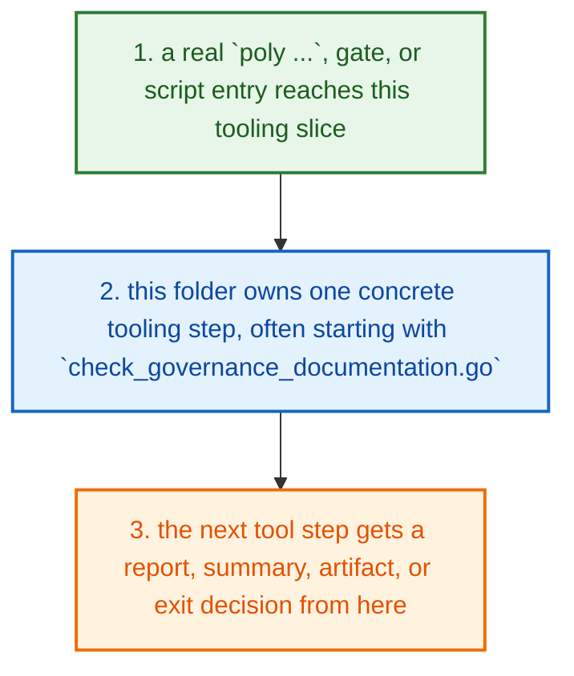
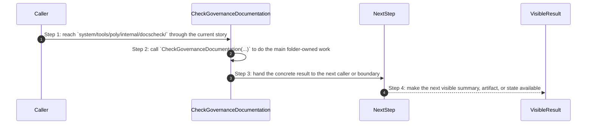
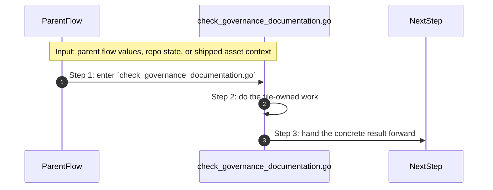
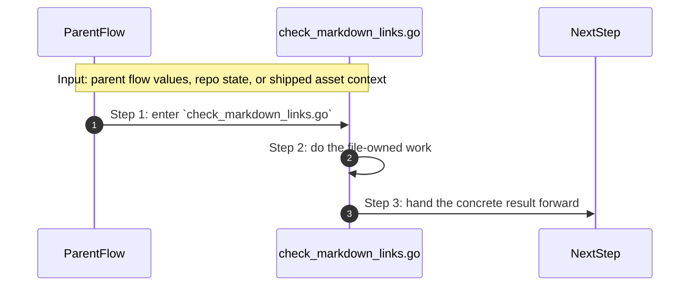
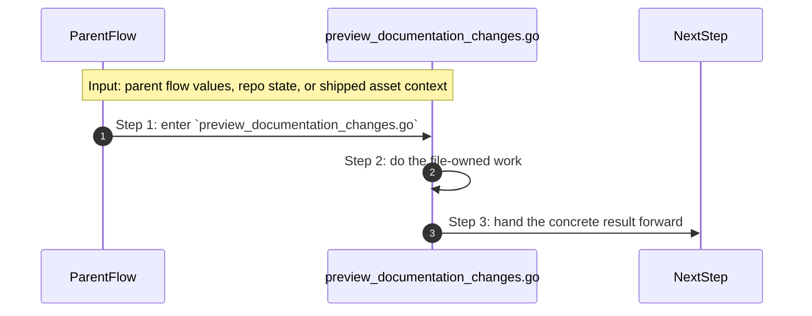

# System Tools Poly Internal Docscheck How This Works

## What this folder is

`system/tools/poly/internal/docscheck/` runs documentation-facing verification logic.

Open this folder when docs governance, link, or preview checks drift from what the docs contract claims.

## Real commands or triggers that reach this folder

- `poly docs governance --phase development --strict`
- `poly docs links --phase development --strict`
- `poly gate run docs`

## Exact upstream handoffs

- `system/tools/poly/internal/runner/run_gate_profile.go` and docs commands above the CLI route into this folder
- `CheckGovernanceDocumentation(...)`, `CheckMarkdownLinks(...)`, and `PreviewDocumentationChanges(...)` own the next check steps here

## The simplest story

- a real `poly ...`, gate, or script entry reaches this tooling slice
- this folder owns one concrete tooling step, often starting with `check_governance_documentation.go`
- the next tool step gets a report, summary, artifact, or exit decision from here



## The first important path

When a real caller reaches this slice for this exact reason:

```bash
poly docs governance --phase development --strict
```

the important path is:



- **Step 1:** This is the moment the story actually enters this folder instead of staying in a higher router or parent helper.
- **Step 2:** The first real work starts in `check_governance_documentation.go` through `CheckGovernanceDocumentation(...)`.
- **Step 3:** From here, the story moves to one smaller file, child slice, or boundary that can do the next concrete job.
- **Step 4:** At the end, the caller has something concrete to carry forward: a file on disk, a rendered asset, a proof artifact, or a clear next state.

## Direct files in this folder

### `check_governance_documentation.go`

This file is one direct stop in the story for this folder.

Why this name is honest:

- its main action is still visible in the code, starting with `CheckGovernanceDocumentation(...)`

When the story opens this file:

- when the `system/tools/poly/internal/docscheck/` story needs this responsibility, it opens `check_governance_documentation.go`

What arrives here:

- caller-provided values from the parent flow

What leaves this file:

- the result of `CheckGovernanceDocumentation(...)` for the next caller
- a concrete return value, file write, check result, or summary depending on the path

Why you open it first:

- open this file when the symptom points to `CheckGovernanceDocumentation(...)` doing the wrong thing



- **Step 1:** The story reaches `check_governance_documentation.go` because this file owns the next small responsibility.
- **Step 2:** The file does its own narrow action instead of mixing it into a bigger caller.
- **Step 3:** The next caller gets a concrete result, not another vague promise.

Important functions:

- `CheckGovernanceDocumentation(...)`
  This is the main action in the file. It does the folder's primary job and returns the next concrete result.
- `runDocEngineValidate(...)`
  Small helper for one narrow sub-step. It exists so the main path stays readable.
- `runLocalDocEngine(...)`
  Small helper for one narrow sub-step. It exists so the main path stays readable.
- `runDocEngineCommand(...)`
  Small helper for one narrow sub-step. It exists so the main path stays readable.
- `docEngineDockerArgs(...)`
  Small helper for one narrow sub-step. It exists so the main path stays readable.
- `workspacePath(...)`
  Small helper for one narrow sub-step. It exists so the main path stays readable.
- `localIDs(...)`
  Small helper for one narrow sub-step. It exists so the main path stays readable.
- `readTSVRows(...)`
  Small helper for one narrow sub-step. It exists so the main path stays readable.
- `column(...)`
  Small helper for one narrow sub-step. It exists so the main path stays readable.
- `tsvContainsCode(...)`
  Small helper for one narrow sub-step. It exists so the main path stays readable.
- `tsvHasStatus(...)`
  Small helper for one narrow sub-step. It exists so the main path stays readable.

### `check_markdown_links.go`

This file is one direct stop in the story for this folder.

Why this name is honest:

- its main action is still visible in the code, starting with `CheckMarkdownLinks(...)`

When the story opens this file:

- when the `system/tools/poly/internal/docscheck/` story needs this responsibility, it opens `check_markdown_links.go`

What arrives here:

- caller-provided values from the parent flow

What leaves this file:

- the result of `CheckMarkdownLinks(...)` for the next caller
- a concrete return value, file write, check result, or summary depending on the path

Why you open it first:

- open this file when the symptom points to `CheckMarkdownLinks(...)` doing the wrong thing



- **Step 1:** The story reaches `check_markdown_links.go` because this file owns the next small responsibility.
- **Step 2:** The file does its own narrow action instead of mixing it into a bigger caller.
- **Step 3:** The next caller gets a concrete result, not another vague promise.

Important functions:

- `CheckMarkdownLinks(...)`
  This is the main action in the file. It does the folder's primary job and returns the next concrete result.
- `extractMarkdownTarget(...)`
  Small helper for one narrow sub-step. It exists so the main path stays readable.
- `isExternalTarget(...)`
  Small helper for one narrow sub-step. It exists so the main path stays readable.
- `resolveTarget(...)`
  Small helper for one narrow sub-step. It exists so the main path stays readable.
- `anchorExists(...)`
  Small helper for one narrow sub-step. It exists so the main path stays readable.
- `slugify(...)`
  Small helper for one narrow sub-step. It exists so the main path stays readable.
- `boolToInt(...)`
  Small helper for one narrow sub-step. It exists so the main path stays readable.

### `preview_documentation_changes.go`

This file is one direct stop in the story for this folder.

Why this name is honest:

- its main action is still visible in the code, starting with `resolveSource(...)`

When the story opens this file:

- when the `system/tools/poly/internal/docscheck/` story needs this responsibility, it opens `preview_documentation_changes.go`

What arrives here:

- caller-provided values from the parent flow

What leaves this file:

- the result of `resolveSource(...)` for the next caller
- a concrete return value, file write, check result, or summary depending on the path

Why you open it first:

- open this file when the symptom points to `resolveSource(...)` doing the wrong thing



- **Step 1:** The story reaches `preview_documentation_changes.go` because this file owns the next small responsibility.
- **Step 2:** The file does its own narrow action instead of mixing it into a bigger caller.
- **Step 3:** The next caller gets a concrete result, not another vague promise.

Important functions:

- `Preview(...)`
  Small helper for one narrow sub-step. It exists so the main path stays readable.
- `resolveSource(...)`
  This is the main action in the file. It does the folder's primary job and returns the next concrete result.
- `defaultPreviewOutput(...)`
  Small helper for one narrow sub-step. It exists so the main path stays readable.

## Child folders in this folder

This folder has no child folders in scope.

## Debug first

- start with `CheckGovernanceDocumentation(...)` in `check_governance_documentation.go` when that action looks wrong
- start with `CheckMarkdownLinks(...)` in `check_markdown_links.go` when that action looks wrong
- start with `resolveSource(...)` in `preview_documentation_changes.go` when that action looks wrong

## What to remember

- `system/tools/poly/internal/docscheck/` exists so this slice has one obvious home.
- The fastest map is still the naming law: folder for flow, file for responsibility, function for exact action.
- If the visible result is wrong, start with the first direct file that owns the next honest action in the flow.

## Dictionary

<a id="dictionary-command"></a>
- `command`: A command is the exact CLI sentence that starts the flow.
<a id="dictionary-gate"></a>
- `gate`: A gate is one named verification profile or check that decides whether trust can increase.
<a id="dictionary-review-pack"></a>
- `review pack`: A review pack is the merged workspace snapshot PolyMoly writes so a reviewer can inspect one deterministic bundle.
<a id="dictionary-artifact"></a>
- `artifact`: An artifact is a summary, report, bundle, or receipt another tool can read later.
<a id="dictionary-summary"></a>
- `summary`: A summary is the short machine-readable or operator-readable result a tool writes after it finishes.
<a id="dictionary-runtime"></a>
- `runtime`: Runtime here means the source-native CLI or external process world the tool starts or inspects.
