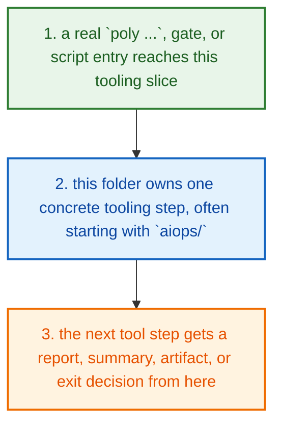
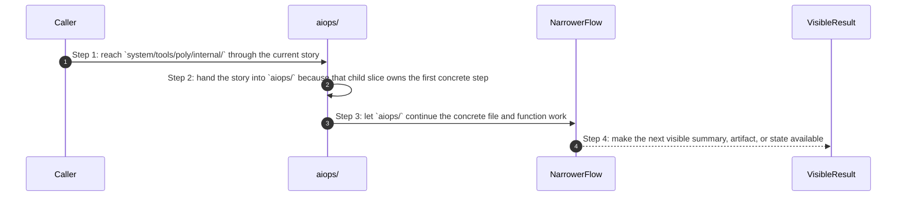

# System Tools Poly Internal How This Works

## What this folder is

`system/tools/poly/internal/` is the machine room behind the Poly CLI and its internal checks.

The source-native CLI entrypoint reaches this tree after repo-root setup. From here the work splits into product routing, checks, runner flows, and compatibility helpers.

## Real commands or triggers that reach this folder

- `poly status`
- `poly gate run docs`
- `poly review pack .`

## Exact upstream handoffs

- the CLI, runner, gates, and shipped runtime assets all eventually hand work into this tree
- open the narrower child slice once you know whether the story is product, engine, adapter, shared, runtime, gate, or tooling work

## The simplest story

- a real `poly ...`, gate, or script entry reaches this tooling slice
- this folder owns one concrete tooling step, often starting with `aiops/`
- the next tool step gets a report, summary, artifact, or exit decision from here



## The first important path

When a real caller reaches this slice for this exact reason:

```bash
poly status
```

the important path is:



- **Step 1:** This is the moment the story actually enters this folder instead of staying in a higher router or parent helper.
- **Step 2:** The first real work starts in `aiops/`.
- **Step 3:** From here, the story moves to one smaller file, child slice, or boundary that can do the next concrete job.
- **Step 4:** At the end, the caller has something concrete to carry forward: a file on disk, a rendered asset, a proof artifact, or a clear next state.

## Direct files in this folder

This folder has no direct first-party files besides this guide.

## Child folders in this folder

### `aiops/`

Open [`aiops/how-this-works.md`](./aiops/how-this-works.md).

Use it when the story includes:

- `poly status`
- `poly gate run docs`
- `poly review pack .`

### `architecture/`

Open [`architecture/how-this-works.md`](./architecture/how-this-works.md).

Use it when the story includes:

- `poly status`
- `poly gate run docs`
- `poly review pack .`

### `backlog/`

Open [`backlog/how-this-works.md`](./backlog/how-this-works.md).

Use it when the story includes:

- `poly status`
- `poly gate run docs`
- `poly review pack .`

### `backupops/`

Open [`backupops/how-this-works.md`](./backupops/how-this-works.md).

Use it when the story includes:

- `poly status`
- `poly gate run docs`
- `poly review pack .`

### `certs/`

Open [`certs/how-this-works.md`](./certs/how-this-works.md).

Use it when the story includes:

- `poly status`
- `poly gate run docs`
- `poly review pack .`

### `checkkit/`

Open [`checkkit/how-this-works.md`](./checkkit/how-this-works.md).

Use it when the story includes:

- `poly status`
- `poly gate run docs`
- `poly review pack .`

### `cli/`

Open [`cli/how-this-works.md`](./cli/how-this-works.md).

Use it when the story includes:

- `poly new my-app --framework laravel`
- `poly status`
- `poly install`
- `poly gate run docs`

### `composeops/`

Open [`composeops/how-this-works.md`](./composeops/how-this-works.md).

Use it when the story includes:

- `poly status`
- `poly gate run docs`
- `poly review pack .`

### `contracts/`

Open [`contracts/how-this-works.md`](./contracts/how-this-works.md).

Use it when the story includes:

- `poly status`
- `poly gate run docs`
- `poly review pack .`

### `dashboardops/`

Open [`dashboardops/how-this-works.md`](./dashboardops/how-this-works.md).

Use it when the story includes:

- `poly status`
- `poly gate run docs`
- `poly review pack .`

### `docscheck/`

Open [`docscheck/how-this-works.md`](./docscheck/how-this-works.md).

Use it when the story includes:

- `poly docs governance --phase development --strict`
- `poly docs links --phase development --strict`
- `poly gate run docs`

### `doctor/`

Open [`doctor/how-this-works.md`](./doctor/how-this-works.md).

Use it when the story includes:

- `poly status`
- `poly gate run docs`
- `poly review pack .`

### `enginecheck/`

Open [`enginecheck/how-this-works.md`](./enginecheck/how-this-works.md).

Use it when the story includes:

- `poly status`
- `poly gate run docs`
- `poly review pack .`

### `enterpriseops/`

Open [`enterpriseops/how-this-works.md`](./enterpriseops/how-this-works.md).

Use it when the story includes:

- `poly status`
- `poly gate run docs`
- `poly review pack .`

### `finops/`

Open [`finops/how-this-works.md`](./finops/how-this-works.md).

Use it when the story includes:

- `poly status`
- `poly gate run docs`
- `poly review pack .`

### `hardeningcheck/`

Open [`hardeningcheck/how-this-works.md`](./hardeningcheck/how-this-works.md).

Use it when the story includes:

- `poly status`
- `poly gate run docs`
- `poly review pack .`

### `installops/`

Open [`installops/how-this-works.md`](./installops/how-this-works.md).

Use it when the story includes:

- `poly install`
- `poly self-update`

### `migrateops/`

Open [`migrateops/how-this-works.md`](./migrateops/how-this-works.md).

Use it when the story includes:

- `poly status`
- `poly gate run docs`
- `poly review pack .`

### `modules/`

Open [`modules/how-this-works.md`](./modules/how-this-works.md).

Use it when the story includes:

- `poly status`
- `poly gate run docs`
- `poly review pack .`

### `perfcheck/`

Open [`perfcheck/how-this-works.md`](./perfcheck/how-this-works.md).

Use it when the story includes:

- `poly status`
- `poly gate run docs`
- `poly review pack .`

### `perfops/`

Open [`perfops/how-this-works.md`](./perfops/how-this-works.md).

Use it when the story includes:

- `poly status`
- `poly gate run docs`
- `poly review pack .`

### `platformcheck/`

Open [`platformcheck/how-this-works.md`](./platformcheck/how-this-works.md).

Use it when the story includes:

- `poly status`
- `poly gate run docs`
- `poly review pack .`

### `platformops/`

Open [`platformops/how-this-works.md`](./platformops/how-this-works.md).

Use it when the story includes:

- platform setup commands and higher operator flows after CLI routing

### `pluginops/`

Open [`pluginops/how-this-works.md`](./pluginops/how-this-works.md).

Use it when the story includes:

- `poly plugin ...`

### `policy/`

Open [`policy/how-this-works.md`](./policy/how-this-works.md).

Use it when the story includes:

- `poly status`
- `poly gate run docs`
- `poly review pack .`

### `policycheck/`

Open [`policycheck/how-this-works.md`](./policycheck/how-this-works.md).

Use it when the story includes:

- `poly status`
- `poly gate run docs`
- `poly review pack .`

### `product/`

Open [`product/how-this-works.md`](./product/how-this-works.md).

Use it when the story includes:

- product-facing CLI flows after `RouteRootCommands(...)` chooses a user story

### `productcheck/`

Open [`productcheck/how-this-works.md`](./productcheck/how-this-works.md).

Use it when the story includes:

- `poly status`
- `poly gate run docs`
- `poly review pack .`

### `profiles/`

Open [`profiles/how-this-works.md`](./profiles/how-this-works.md).

Use it when the story includes:

- `poly status`
- `poly gate run docs`
- `poly review pack .`

### `projectcfg/`

Open [`projectcfg/how-this-works.md`](./projectcfg/how-this-works.md).

Use it when the story includes:

- `poly status`
- `poly gate run docs`
- `poly review pack .`

### `releasecheck/`

Open [`releasecheck/how-this-works.md`](./releasecheck/how-this-works.md).

Use it when the story includes:

- `poly status`
- `poly gate run docs`
- `poly review pack .`

### `releaseops/`

Open [`releaseops/how-this-works.md`](./releaseops/how-this-works.md).

Use it when the story includes:

- `poly release ...`

### `renderer/`

Open [`renderer/how-this-works.md`](./renderer/how-this-works.md).

Use it when the story includes:

- `poly status`
- `poly gate run docs`
- `poly review pack .`

### `resiliencecheck/`

Open [`resiliencecheck/how-this-works.md`](./resiliencecheck/how-this-works.md).

Use it when the story includes:

- `poly status`
- `poly gate run docs`
- `poly review pack .`

### `resilienceops/`

Open [`resilienceops/how-this-works.md`](./resilienceops/how-this-works.md).

Use it when the story includes:

- `poly status`
- `poly gate run docs`
- `poly review pack .`

### `reviewpack/`

Open [`reviewpack/how-this-works.md`](./reviewpack/how-this-works.md).

Use it when the story includes:

- `poly review pack .`

### `runner/`

Open [`runner/how-this-works.md`](./runner/how-this-works.md).

Use it when the story includes:

- `poly gate run docs`
- `poly gate run p0`
- `poly review pack .`

### `runtimecheck/`

Open [`runtimecheck/how-this-works.md`](./runtimecheck/how-this-works.md).

Use it when the story includes:

- `poly status`
- `poly gate run docs`
- `poly review pack .`

### `scanner/`

Open [`scanner/how-this-works.md`](./scanner/how-this-works.md).

Use it when the story includes:

- `poly status`
- `poly gate run docs`
- `poly review pack .`

### `secretsops/`

Open [`secretsops/how-this-works.md`](./secretsops/how-this-works.md).

Use it when the story includes:

- `poly status`
- `poly gate run docs`
- `poly review pack .`

### `securityops/`

Open [`securityops/how-this-works.md`](./securityops/how-this-works.md).

Use it when the story includes:

- `poly status`
- `poly gate run docs`
- `poly review pack .`

### `system/`

Open [`system/how-this-works.md`](./system/how-this-works.md).

Use it when the story includes:

- `poly status`
- `poly gate run docs`
- `poly review pack .`

### `toolboxops/`

Open [`toolboxops/how-this-works.md`](./toolboxops/how-this-works.md).

Use it when the story includes:

- `poly status`
- `poly gate run docs`
- `poly review pack .`

## Debug first

- open `aiops/how-this-works.md` when the symptom clearly belongs to that child story
- open `architecture/how-this-works.md` when the symptom clearly belongs to that child story
- open `backlog/how-this-works.md` when the symptom clearly belongs to that child story
- open `backupops/how-this-works.md` when the symptom clearly belongs to that child story
- open `certs/how-this-works.md` when the symptom clearly belongs to that child story
- open `checkkit/how-this-works.md` when the symptom clearly belongs to that child story
- open `cli/how-this-works.md` when the symptom clearly belongs to that child story
- open `composeops/how-this-works.md` when the symptom clearly belongs to that child story

## What to remember

- `system/tools/poly/internal/` exists so this slice has one obvious home.
- The fastest map is still the naming law: folder for flow, file for responsibility, function for exact action.
- If the folder overview feels too wide, jump to the child slice that matches the current symptom instead of reading sideways.

## Dictionary

<a id="dictionary-command"></a>
- `command`: A command is the exact CLI sentence that starts the flow.
<a id="dictionary-gate"></a>
- `gate`: A gate is one named verification profile or check that decides whether trust can increase.
<a id="dictionary-review-pack"></a>
- `review pack`: A review pack is the merged workspace snapshot PolyMoly writes so a reviewer can inspect one deterministic bundle.
<a id="dictionary-artifact"></a>
- `artifact`: An artifact is a summary, report, bundle, or receipt another tool can read later.
<a id="dictionary-summary"></a>
- `summary`: A summary is the short machine-readable or operator-readable result a tool writes after it finishes.
<a id="dictionary-runtime"></a>
- `runtime`: Runtime here means the source-native CLI or external process world the tool starts or inspects.
