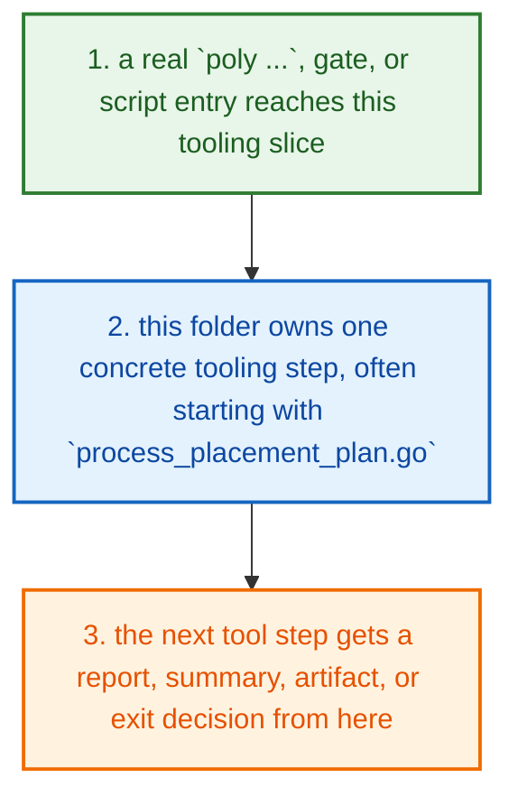
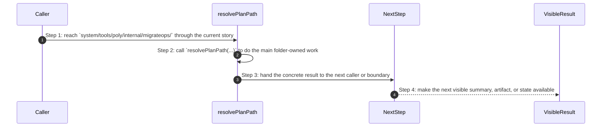
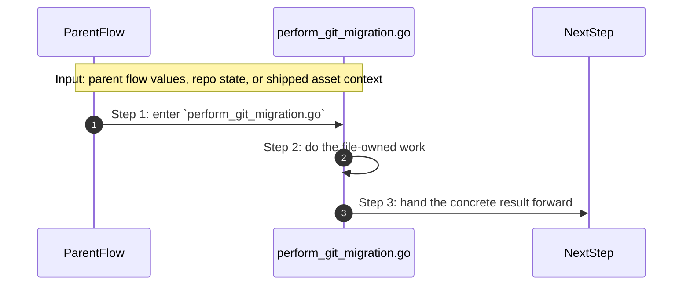
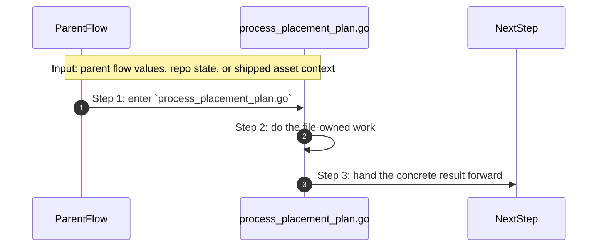
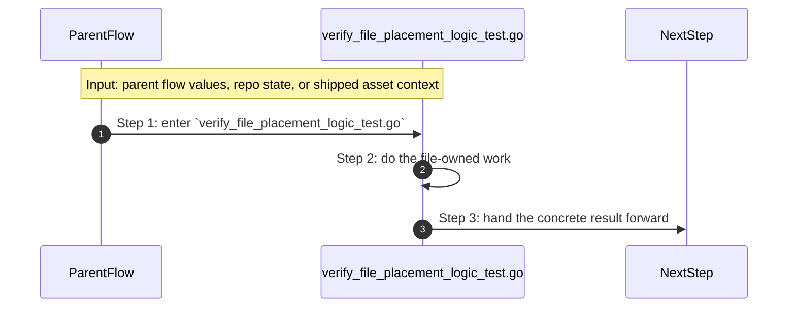

# System Tools Poly Internal Migrateops How This Works

## What this folder is

`system/tools/poly/internal/migrateops/` is one internal Poly tooling slice.

This folder exists so one small tooling responsibility has an obvious home after the CLI or runner hands work into the internal tree.

## Real commands or triggers that reach this folder

- `poly status`
- `poly gate run docs`
- `poly review pack .`

## Exact upstream handoffs

- the CLI, runner, gates, and shipped runtime assets all eventually hand work into this tree
- open the narrower child slice once you know whether the story is product, engine, adapter, shared, runtime, gate, or tooling work

## The simplest story

- a real `poly ...`, gate, or script entry reaches this tooling slice
- this folder owns one concrete tooling step, often starting with `process_placement_plan.go`
- the next tool step gets a report, summary, artifact, or exit decision from here



## The first important path

When a real caller reaches this slice for this exact reason:

```bash
poly status
```

the important path is:



- **Step 1:** This is the moment the story actually enters this folder instead of staying in a higher router or parent helper.
- **Step 2:** The first real work starts in `process_placement_plan.go` through `resolvePlanPath(...)`.
- **Step 3:** From here, the story moves to one smaller file, child slice, or boundary that can do the next concrete job.
- **Step 4:** At the end, the caller has something concrete to carry forward: a file on disk, a rendered asset, a proof artifact, or a clear next state.

## Direct files in this folder

### `perform_git_migration.go`

This file is one direct stop in the story for this folder.

Why this name is honest:

- its main action is still visible in the code, starting with `gitTrackedFiles(...)`

When the story opens this file:

- when the `system/tools/poly/internal/migrateops/` story needs this responsibility, it opens `perform_git_migration.go`

What arrives here:

- caller-provided values from the parent flow

What leaves this file:

- the result of `gitTrackedFiles(...)` for the next caller
- a concrete return value, file write, check result, or summary depending on the path

Why you open it first:

- open this file when the symptom points to `gitTrackedFiles(...)` doing the wrong thing



- **Step 1:** The story reaches `perform_git_migration.go` because this file owns the next small responsibility.
- **Step 2:** The file does its own narrow action instead of mixing it into a bigger caller.
- **Step 3:** The next caller gets a concrete result, not another vague promise.

Important functions:

- `gitTrackedFiles(...)`
  This is the main action in the file. It does the folder's primary job and returns the next concrete result.
- `walkTrackedFiles(...)`
  Small helper for one narrow sub-step. It exists so the main path stays readable.

### `process_placement_plan.go`

This file is one direct stop in the story for this folder.

Why this name is honest:

- its main action is still visible in the code, starting with `resolvePlanPath(...)`

When the story opens this file:

- when the `system/tools/poly/internal/migrateops/` story needs this responsibility, it opens `process_placement_plan.go`

What arrives here:

- caller-provided values from the parent flow

What leaves this file:

- the result of `resolvePlanPath(...)` for the next caller
- a concrete return value, file write, check result, or summary depending on the path

Why you open it first:

- open this file when the symptom points to `resolvePlanPath(...)` doing the wrong thing



- **Step 1:** The story reaches `process_placement_plan.go` because this file owns the next small responsibility.
- **Step 2:** The file does its own narrow action instead of mixing it into a bigger caller.
- **Step 3:** The next caller gets a concrete result, not another vague promise.

Important functions:

- `EvaluatePlacementPlan(...)`
  Small helper for one narrow sub-step. It exists so the main path stays readable.
- `DropShims(...)`
  Small helper for one narrow sub-step. It exists so the main path stays readable.
- `Rewrite(...)`
  Small helper for one narrow sub-step. It exists so the main path stays readable.
- `resolvePlanPath(...)`
  This is the main action in the file. It does the folder's primary job and returns the next concrete result.
- `loadManifest(...)`
  Small helper for one narrow sub-step. It exists so the main path stays readable.
- `selectPhases(...)`
  Small helper for one narrow sub-step. It exists so the main path stays readable.
- `validateSelectedPhases(...)`
  Small helper for one narrow sub-step. It exists so the main path stays readable.
- `evaluatePhase(...)`
  Small helper for one narrow sub-step. It exists so the main path stays readable.
- `evaluateMove(...)`
  Small helper for one narrow sub-step. It exists so the main path stays readable.
- `applyReadyMoves(...)`
  Small helper for one narrow sub-step. It exists so the main path stays readable.
- `buildCoverageReport(...)`
  Small helper for one narrow sub-step. It exists so the main path stays readable.
- `buildHeatmap(...)`
  Small helper for one narrow sub-step. It exists so the main path stays readable.
- `buildReferenceIndex(...)`
  Small helper for one narrow sub-step. It exists so the main path stays readable.
- `extractIndexTokens(...)`
  Small helper for one narrow sub-step. It exists so the main path stays readable.
- `writePlacementArtifacts(...)`
  Small helper for one narrow sub-step. It exists so the main path stays readable.
- `writeRewriteArtifacts(...)`
  Small helper for one narrow sub-step. It exists so the main path stays readable.
- `writeShimArtifacts(...)`
  Small helper for one narrow sub-step. It exists so the main path stays readable.
- `resolveArtifactsDir(...)`
  Small helper for one narrow sub-step. It exists so the main path stays readable.
- `writeJSON(...)`
  Small helper for one narrow sub-step. It exists so the main path stays readable.
- `cleanRelative(...)`
  Small helper for one narrow sub-step. It exists so the main path stays readable.
- `overlaps(...)`
  Small helper for one narrow sub-step. It exists so the main path stays readable.
- `updateTotals(...)`
  Small helper for one narrow sub-step. It exists so the main path stays readable.
- `mergeTotals(...)`
  Small helper for one narrow sub-step. It exists so the main path stays readable.
- `mustRel(...)`
  Small helper for one narrow sub-step. It exists so the main path stays readable.
- `normalizeCoveragePatterns(...)`
  Small helper for one narrow sub-step. It exists so the main path stays readable.
- `matchesAnyPrefix(...)`
  Small helper for one narrow sub-step. It exists so the main path stays readable.
- `matchesPrefix(...)`
  Small helper for one narrow sub-step. It exists so the main path stays readable.
- `createShim(...)`
  Small helper for one narrow sub-step. It exists so the main path stays readable.
- `evaluateShimMove(...)`
  Small helper for one narrow sub-step. It exists so the main path stays readable.
- `updateShimTotals(...)`
  Small helper for one narrow sub-step. It exists so the main path stays readable.
- `canMergeMove(...)`
  Small helper for one narrow sub-step. It exists so the main path stays readable.
- `mergeMove(...)`
  Small helper for one narrow sub-step. It exists so the main path stays readable.
- `samePath(...)`
  Small helper for one narrow sub-step. It exists so the main path stays readable.
- `isTextFile(...)`
  Small helper for one narrow sub-step. It exists so the main path stays readable.
- `rewritePathReferences(...)`
  Small helper for one narrow sub-step. It exists so the main path stays readable.
- `canRewritePathReference(...)`
  Small helper for one narrow sub-step. It exists so the main path stays readable.
- `rewriteGuardPrefix(...)`
  Small helper for one narrow sub-step. It exists so the main path stays readable.
- `isPathTokenChar(...)`
  Small helper for one narrow sub-step. It exists so the main path stays readable.
- `rewriteTargetFiles(...)`
  Small helper for one narrow sub-step. It exists so the main path stays readable.
- `excludeRewriteTargets(...)`
  Small helper for one narrow sub-step. It exists so the main path stays readable.
- `matchesExt(...)`
  Small helper for one narrow sub-step. It exists so the main path stays readable.
- `ternary(...)`
  Small helper for one narrow sub-step. It exists so the main path stays readable.
- `emptyAs(...)`
  Small helper for one narrow sub-step. It exists so the main path stays readable.

### `verify_file_placement_logic_test.go`

This test file locks one real behavior in this folder and fails loudly when that behavior drifts.

Why this name is honest:

- its main action is still visible in the code, starting with `TestRunDryRunReportsReadySplitFirstAndOptionalMissing(...)`

When the story opens this file:

- when the `system/tools/poly/internal/migrateops/` story needs this responsibility, it opens `verify_file_placement_logic_test.go`

What arrives here:

- caller-provided values from the parent flow

What leaves this file:

- test proof for one regression shape
- clear failure when the behavior drifts

Why you open it first:

- a test case in this file is the fastest proof of the contract that drifted



- **Step 1:** The story reaches `verify_file_placement_logic_test.go` because this file owns the next small responsibility.
- **Step 2:** The file does its own narrow action instead of mixing it into a bigger caller.
- **Step 3:** The next caller gets a concrete result, not another vague promise.

Important functions:

- `TestRunDryRunReportsReadySplitFirstAndOptionalMissing(...)`
  One proof case in this file. It locks one expected behavior so a regression fails loudly.
- `TestRunApplyMovesReadyEntries(...)`
  One proof case in this file. It locks one expected behavior so a regression fails loudly.
- `TestRunApplyReadyOnlyMovesSubsetWhenSplitFirstExists(...)`
  One proof case in this file. It locks one expected behavior so a regression fails loudly.
- `TestRunRejectsOverlappingSources(...)`
  One proof case in this file. It locks one expected behavior so a regression fails loudly.
- `TestRewriteMatchesSpecialBasenames(...)`
  One proof case in this file. It locks one expected behavior so a regression fails loudly.
- `TestRewriteUsesPathBoundariesAndAvoidsDoubleMigration(...)`
  One proof case in this file. It locks one expected behavior so a regression fails loudly.
- `TestRewriteSkipsPlacementPlanEvenWhenTargeted(...)`
  One proof case in this file. It locks one expected behavior so a regression fails loudly.
- `TestDropShimsRemovesCanonicalSymlinkSources(...)`
  One proof case in this file. It locks one expected behavior so a regression fails loudly.
- `TestDropShimsBlocksNonSymlinkSources(...)`
  One proof case in this file. It locks one expected behavior so a regression fails loudly.
- `TestBuildCoverageReportTreatsCanonicalProductAndSystemIncludesAsCovered(...)`
  One proof case in this file. It locks one expected behavior so a regression fails loudly.
- `TestGitTrackedFilesIncludesUntrackedWorktreeTargets(...)`
  One proof case in this file. It locks one expected behavior so a regression fails loudly.

## Child folders in this folder

This folder has no child folders in scope.

## Debug first

- start with `gitTrackedFiles(...)` in `perform_git_migration.go` when that action looks wrong
- start with `resolvePlanPath(...)` in `process_placement_plan.go` when that action looks wrong
- start with `TestRunDryRunReportsReadySplitFirstAndOptionalMissing(...)` in `verify_file_placement_logic_test.go` when that action looks wrong

## What to remember

- `system/tools/poly/internal/migrateops/` exists so this slice has one obvious home.
- The fastest map is still the naming law: folder for flow, file for responsibility, function for exact action.
- If the visible result is wrong, start with the first direct file that owns the next honest action in the flow.

## Dictionary

<a id="dictionary-command"></a>
- `command`: A command is the exact CLI sentence that starts the flow.
<a id="dictionary-gate"></a>
- `gate`: A gate is one named verification profile or check that decides whether trust can increase.
<a id="dictionary-review-pack"></a>
- `review pack`: A review pack is the merged workspace snapshot PolyMoly writes so a reviewer can inspect one deterministic bundle.
<a id="dictionary-artifact"></a>
- `artifact`: An artifact is a summary, report, bundle, or receipt another tool can read later.
<a id="dictionary-summary"></a>
- `summary`: A summary is the short machine-readable or operator-readable result a tool writes after it finishes.
<a id="dictionary-runtime"></a>
- `runtime`: Runtime here means the source-native CLI or external process world the tool starts or inspects.
