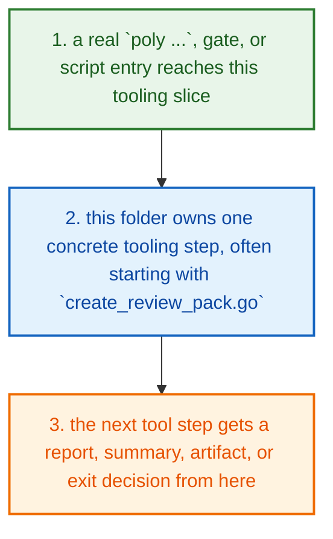
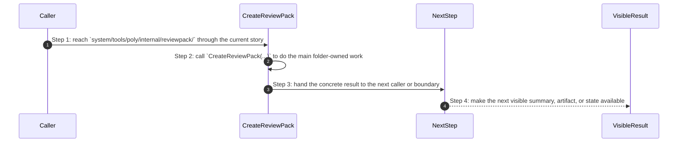
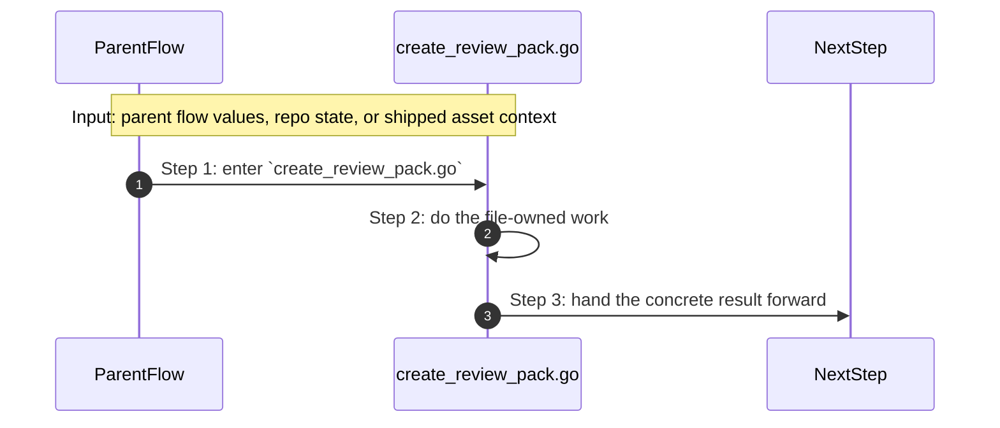

# System Tools Poly Internal Reviewpack How This Works

## What this folder is

`system/tools/poly/internal/reviewpack/` creates the merged workspace snapshot reviewers read later.

This is the slice that turns many repo files into one deterministic review bundle.

## Real commands or triggers that reach this folder

- `poly review pack .`

## Exact upstream handoffs

- `system/tools/poly/internal/cli/route_root_commands.go` reaches this folder when the user runs `poly review pack ...`
- `CreateReviewPack(...)` is the narrow handoff that turns many files into one review bundle`

## The simplest story

- a real `poly ...`, gate, or script entry reaches this tooling slice
- this folder owns one concrete tooling step, often starting with `create_review_pack.go`
- the next tool step gets a report, summary, artifact, or exit decision from here



## The first important path

When a real caller reaches this slice for this exact reason:

```bash
poly review pack .
```

the important path is:



- **Step 1:** This is the moment the story actually enters this folder instead of staying in a higher router or parent helper.
- **Step 2:** The first real work starts in `create_review_pack.go` through `CreateReviewPack(...)`.
- **Step 3:** From here, the story moves to one smaller file, child slice, or boundary that can do the next concrete job.
- **Step 4:** At the end, the caller has something concrete to carry forward: a file on disk, a rendered asset, a proof artifact, or a clear next state.

## Direct files in this folder

### `create_review_pack.go`

This file is one direct stop in the story for this folder.

Why this name is honest:

- its main action is still visible in the code, starting with `CreateReviewPack(...)`

When the story opens this file:

- when the `system/tools/poly/internal/reviewpack/` story needs this responsibility, it opens `create_review_pack.go`

What arrives here:

- caller-provided values from the parent flow

What leaves this file:

- the result of `CreateReviewPack(...)` for the next caller
- a concrete return value, file write, check result, or summary depending on the path

Why you open it first:

- open this file when the symptom points to `CreateReviewPack(...)` doing the wrong thing



- **Step 1:** The story reaches `create_review_pack.go` because this file owns the next small responsibility.
- **Step 2:** The file does its own narrow action instead of mixing it into a bigger caller.
- **Step 3:** The next caller gets a concrete result, not another vague promise.

Important functions:

- `CreateReviewPack(...)`
  This is the main action in the file. It does the folder's primary job and returns the next concrete result.

## Child folders in this folder

This folder has no child folders in scope.

## Debug first

- start with `CreateReviewPack(...)` in `create_review_pack.go` when that action looks wrong

## What to remember

- `system/tools/poly/internal/reviewpack/` exists so this slice has one obvious home.
- The fastest map is still the naming law: folder for flow, file for responsibility, function for exact action.
- If the visible result is wrong, start with the first direct file that owns the next honest action in the flow.

## Dictionary

<a id="dictionary-command"></a>
- `command`: A command is the exact CLI sentence that starts the flow.
<a id="dictionary-gate"></a>
- `gate`: A gate is one named verification profile or check that decides whether trust can increase.
<a id="dictionary-review-pack"></a>
- `review pack`: A review pack is the merged workspace snapshot PolyMoly writes so a reviewer can inspect one deterministic bundle.
<a id="dictionary-artifact"></a>
- `artifact`: An artifact is a summary, report, bundle, or receipt another tool can read later.
<a id="dictionary-summary"></a>
- `summary`: A summary is the short machine-readable or operator-readable result a tool writes after it finishes.
<a id="dictionary-runtime"></a>
- `runtime`: Runtime here means the source-native CLI or external process world the tool starts or inspects.
