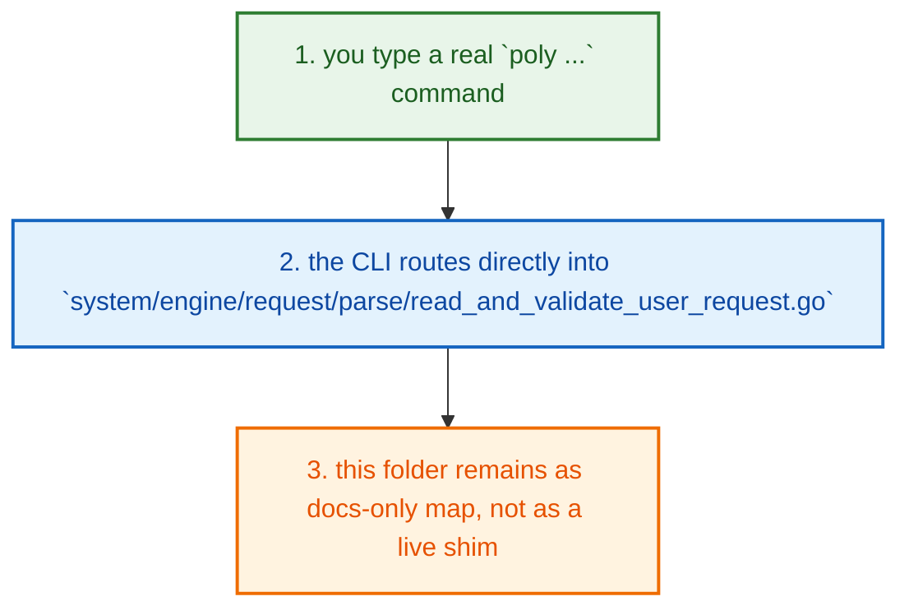

# System Tools Poly Internal System Engine Request How This Works

## What this folder is

`system/tools/poly/internal/system/engine/request/` is now a docs-only compatibility checkpoint.

The old local shim file was removed because it was dead code. The real request
entrypoint lives in the canonical engine tree under
`system/engine/request/parse/read_and_validate_user_request.go`.

## Real commands or triggers that used to map here

- `poly ...` commands that eventually need engine request parsing
- gate or review paths that inspect request parsing behavior

## The simplest story

- when you type a real command like `poly status`, the CLI does not enter a
  local request shim in this folder anymore
- it goes straight to the canonical engine request path
- this folder stays only so the documentation map and folder story remain easy
  to follow

## The first important path

When you want the real parser story, open this file first:

- `system/engine/request/parse/read_and_validate_user_request.go`

That is where request payload reading, validation, and normalized engine input
actually happen now.

## Direct files in this folder

This folder currently has no live Go source files.

## Debug first

- start with `ReadAndValidateUserRequest(...)` in `system/engine/request/parse/read_and_validate_user_request.go` when request parsing looks wrong

## What to remember

- this folder no longer owns runtime behavior
- the dead shim was removed on purpose
- the real behavior is in the canonical engine request path, not here

## Dictionary

- `command`: A command is the exact CLI sentence that starts the flow.

- `request`: A request is the normalized input object the engine reads before it decides anything.

- `parser`: A parser is the code that takes raw input and turns it into a safe structured shape.
