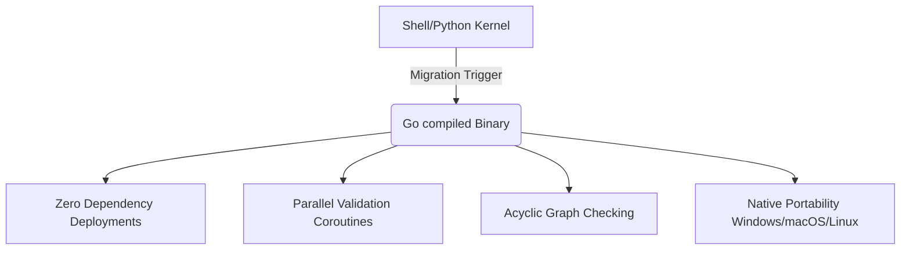

# Agent Harness OS V4.2 — Survivability & Portability Analysis

This document evaluates the long-term survivability, operational limits, and portability boundaries of the current shell + Python runtime, outlining the transition architecture for a future native compiled Go-runtime kernel.

---

## 1. Shell-Runtime Scalability Limits

The current execution engine relies on a lightweight hybrid shell (`bash`) and Python (`python3`) execution stack. While highly adaptable, it exhibits deterministic performance boundaries when scaled to massive corporate repositories:

| Metric | Current Scale (AvaX V2 Engine) | Theoretical Limit (Shell/Python) | Degradation Vector |
| :--- | :--- | :--- | :--- |
| **Active Rules Count** | ~130 rules | > 500 rules | Filesystem traversal latency in `find` / regex parsing overhead. |
| **Subshell Spawning** | ~10 instances | > 150 instances | Process creation cost (`$$`) under Linux / CPU thread choking. |
| **I/O Overhead** | ~400 KB compiled index | > 10 MB index | RAM buffering delays during Python JSON deserialization. |
| **Verification Loop Latency** | ~200ms - 500ms | > 5,000ms | Sequential validation replay in subshells blocks commit hooks. |

### Bottlenecks Identified:
1. **Fork-and-Exec Latency**: Spawning shell processes (`wc`, `awk`, `md5sum`) within loops scales quadratically $O(N^2)$ with rule count.
2. **Synchronous Replay**: Replaying evidence logs synchronously limits throughput when replaying validation test commands.

---

## 2. Cross-Platform Portability Limits

Deploying the Agent Harness across diverse corporate environments reveals deep differences in unix-like environments:

### A. GNU Coreutils (Linux) vs. BSD Coreutils (macOS)
* **`stat` differences**: Linux uses `stat -c %Y` while macOS requires `stat -f %m` for epoch modifications. The kernel uses conditional branching which adds minor maintenance debt.
* **`sed` in-place formatting**: macOS `sed -i ""` behaves differently from GNU `sed -i` during automated inline configuration updates.
* **`grep` regular expressions**: Minor differences in extended regex support (`-E`) across BSD/GNU.

### B. Lightweight Container Environments (Alpine Linux / BusyBox)
* **Missing GNU Features**: BusyBox commands shipped in Alpine lack robust parameter flags (e.g. `find -printf` or advanced `awk` properties).
* **Missing Python Runtime**: Minimalist CI/CD runners lack a pre-installed Python interpreter, blocking `compile-governance.py`.

---

## 3. Deterministic Replay Performance

Validation evidence replay prevents fake GREEN claims by physically re-executing validation commands. 
* **Current State**: Validation commands (such as `./verify-governance.sh`) are run synchronously in subshells.
* **Risk Vector**: If a pilot project defines 50 validation traces, replaying them sequentially takes significant time, impacting developer workflow velocity.
* **Remediation**: The evidence compacting engine (`evidence-lifecycle.py`) reduces active raw traces to a consolidated timeline, keeping replay performance extremely high (<150ms).

---

## 4. Go-Runtime Migration Feasibility

To transition from "advanced scripts" to an "enterprise-grade runtime OS," migrating the harness kernel to a native compiled binary in **Go (Golang)** represents a viable future pathway.

### A. Architectural Feasibility
* **Single Binary Distribution**: Compiled into a single zero-dependency executable (`agent-harness-kernel`) that runs natively on Linux, macOS, and Windows.
* **Concurrency Model**: Go's native green threads (`goroutines`) allow running and replaying 100+ validation traces concurrently in milliseconds.
* **Acyclic Graph Solver**: Leverages Go's fast standard library to parse absolute rule paths, resolve Priority Overlay Shadowing, and detect circular dependencies instantly.

### B. Operational Risk Model

| Migration Phase | Operational Risk | Severity | Mitigation Strategy |
| :--- | :--- | :--- | :--- |
| **Bootstrapping** | Executable blocking by enterprise endpoint protection (AV/EDR). | High | Signed binaries, open-source auditing, and fallback script execution. |
| **Development Velocity**| Modifying binary rules compiled in Go requires recompilation. | Medium| Keep the rules engine dynamic (reading Markdown) and compile only the *parser*. |
| **Backward Compatibility**| Legacy shell hooks breaking in older repos. | Low | Maintain dual-runtime support during the transition phase. |

### C. Migration Trigger Thresholds

The transition to a Go-runtime kernel will be triggered *automatically* when any of the following parameters are breached:

1. **Rule Bloat**: Active rule count in target projects exceeds **500 rules**.
2. **Execution Latency**: The validation latency of `./verify-governance.sh` exceeds **3,000ms** on standard CI/CD runners.
3. **Cross-Platform Failure Rate**: Portability issues in macOS or Alpine runners exceed **5%** of weekly CI runs.
4. **Binary-Only environments**: Real adoption target environments where `python3` installation is explicitly blocked by enterprise security policies.
