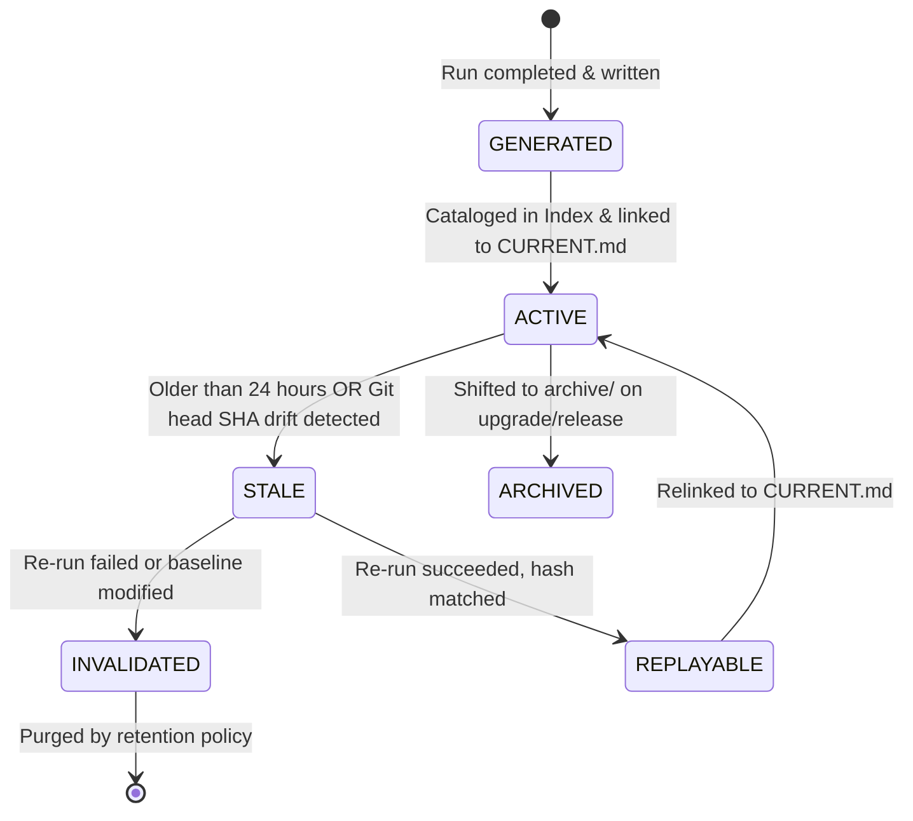

# Enterprise Evidence Model (V4.2 Hardened)

Version: 4.2.0
Status: Normative / Universal
Scope: `./**`

## Purpose

Define the absolute, machine-verifiable operational evidence specifications for the Agent Harness. To maintain operational truth, this model strictly isolates high-signal, human-scannable summaries from dense, machine-verifiable verification logs and execution traces.

---

## 1. The Two-Layer Architecture

### A. The Calm Human Dashboard: `EVIDENCE/`
The root `EVIDENCE/` directory is designed for human engineering oversight. It must remain scannable in under 30 seconds and must contain **only** these 5 canonical files:
1. `README.md`: Directory guide, quick-links, and local validation mandates.
2. `CURRENT.md`: Authoritative current state snapshot, including the current operational status.
3. `ACTIVE_PLAN.md`: Active execution phase and detailed task list.
4. `FLOW.md`: High-level phase transitions and architectural milestones.
5. `LINKS.md`: Clickable index linking human claims to detailed machine evidence.

*Strict Anti-Bloat Floor*:
- No file in `EVIDENCE/` may exceed **50 lines** in length.
- Any detailed log, recursive review dump, or static analysis output is strictly forbidden here.
- Automated gates will fail (Exit Code 13) if any file exceeds this threshold or contains orphan/unrecognized files (Exit Code 14).

### B. Dense Machine Evidence: `.agents/management/evidence/`
Verbose, structured, and machine-readable logs are stored in standardized subdirectories:
- `raw/`: Raw subprocess logs, console dumps, and debugger traces.
- `validation/`: Outputs of compiler, test runner, and verify-governance gates.
- `traces/`: Multi-agent execution steps, context summaries, and prompt sequences.
- `generated/`: Artifacts created automatically during operations (e.g. temporary build files).
- `replay/`: Playback scripts, state snapshots, and regression proofs.
- `archive/`: Rolled-over past evidence files (e.g., from completed sprints or older releases).
- `truth/`: The central registry of hashes, lineage logs, and verification proof files.

---

## 2. Evidence Lineage & Provenance Model

Every evidence artifact generated under `.agents/management/evidence/` must be cataloged in the **Evidence Index** (`.agents/management/evidence/index.json`).

### A. Provenance Attributes
Every registered evidence record must track:
- `uuid`: Globally unique identifier for the execution run.
- `timestamp`: UTC ISO-8601 creation time.
- `generating_agent`: The active agent role or tool system name.
- `trigger`: The specific Git commit SHA, PR, or manual command that initiated the run.
- `duration_ms`: Total execution time of the validation run.
- `hash`: SHA-256 fingerprint of the resulting file content.

### B. Lineage Relationships
The lineage model defines explicit parent-child links:
- **Parent**: The active planning task (`EVIDENCE/ACTIVE_PLAN.md` entry) or trigger commit.
- **Child**: The execution trace and validation logs generated.
- This creates an unbroken chain of custody, ensuring that no `FULL_GREEN` status can be claimed without a verified, traceable lineage linking back to successful tests.

---

## 3. Evidence Lifecycle States

All machine evidence artifacts transition through these formal states:

### A. State Definitions
1. **GENERATED**: Freshly written validation outputs that are not yet cataloged in the central index.
2. **ACTIVE**: The current, validated state referenced by `EVIDENCE/CURRENT.md` and matching the current system state.
3. **STALE**: Subject to expiration:
   - *Time Expiration*: Older than **24 hours** without update.
   - *Drift Expiration*: Git HEAD commit SHA differs from the claimed SHA in `CURRENT.md`, and new commits have modified source files.
4. **ARCHIVED**: Historical evidence relocated to `archive/` to keep active spaces clean.
5. **REPLAYABLE**: Evidence that includes the exact command, environment variables, and seeds required to reproduce the same output.
6. **INVALIDATED**: Evidence that belongs to a failed execution or has been contradicted by newer manual modifications.

---

## 4. Operational Controls

### A. Oversized Artifact Routing
- When an agent or script produces an evidence report, if the report exceeds 50 lines, it must be saved directly to `.agents/management/evidence/validation/` or `raw/`.
- A human-scannable summary (maximum 5 lines) must be written to `EVIDENCE/LINKS.md` with a clickable file link to the deep report.

### B. Duplicate Evidence Detection
- During every run of `verify-governance.sh`, the system scans the Evidence Index for duplicate SHA-256 hashes.
- If duplicate verification files exist under different names, it indicates sloppy copy-pasting or fake proofs. The gate will fail immediately (Exit Code 18).

### C. Stale Evidence Mitigation
- If `verify-governance.sh` detects that the active evidence is `STALE` (due to time or Git drift), it will trigger a warning. If running in strict CI/CD gate mode, it will exit with a non-zero code to block the build, forcing the execution agent to re-validate and generate fresh active evidence.

*No offload recommended for this step.*
