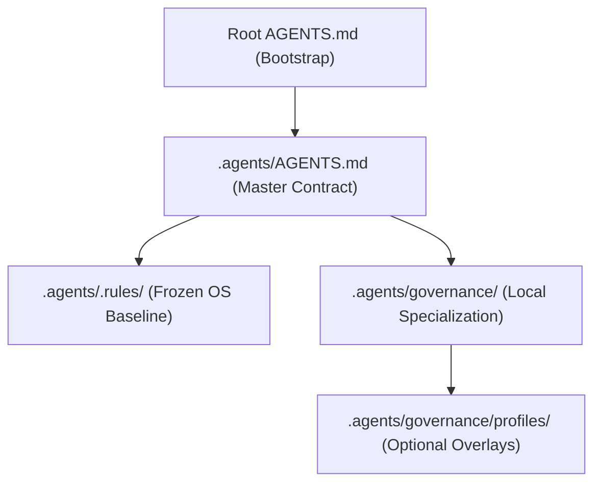

# Final Truth Pass — Phase 2: Source of Truth Map

This document defines the definitive governance and data map for the Agent Harness V3 OS.

## 1. Governance Map

## 2. Definitive Truth Locations

| Component | Primary Location | Verification Method |
|---|---|---|
| **Agents Start** | Root `AGENTS.md` | Order of Precedence |
| **Reusable OS Rules** | `.agents/.rules/governance/` | `./install-os.sh --validate` |
| **Local Project Rules**| `.agents/governance/` | Recursive Review |
| **Machine Evidence** | `.agents/management/evidence/` | JSON Schema Validation |
| **Human Dashboard** | `EVIDENCE/` | Anti-bloat check (<50 lines) |
| **Profiles** | `.agents/governance/profiles/` | Profile Resolution Alg |
| **Schemas** | `.agents/config/schemas/` | Python JSON parse check |
| **Compatibility** | `projects/` (legacy samples) | Explicitly excluded from core |

## 3. Lifecycles

### Bootstrap Lifecycle
1.  **Read**: Agent reads root `AGENTS.md`.
2.  **Resolve**: Agent follows `Order Of Precedence`.
3.  **Boot**: Agent reads `.agents/governance/core/bootstrap/agent-bootstrap.md`.
4.  **Adopt**: Agent aligns its role to `agent-roles.md`.

### Evidence Lifecycle
1.  **Execute**: Agent performs task.
2.  **Capture**: Agent writes raw output to `.agents/management/evidence/raw/`.
3.  **Validate**: Agent validates output against `schemas/*.schema.json`.
4.  **Record**: Agent writes machine evidence to `.agents/management/evidence/phases/`.
5.  **Summarize**: Agent updates human dashboard in `EVIDENCE/`.

### Profile Resolution Lifecycle
1.  **Identify**: Read `AGENTS.md` for language/framework/project-type/overlay.
2.  **Load**: Load `.agents/governance/profiles/` based on selection.
3.  **Merge**: Apply `profile-resolution-algorithm.md`.
4.  **Check**: Detect and log conflicts.

## 4. Compatibility Layer

Files under `projects/` are **historical reference samples**. They are NOT active governance for the harness. They are kept to show the evolution path but are strictly isolated from the `.agents/` runtime.
